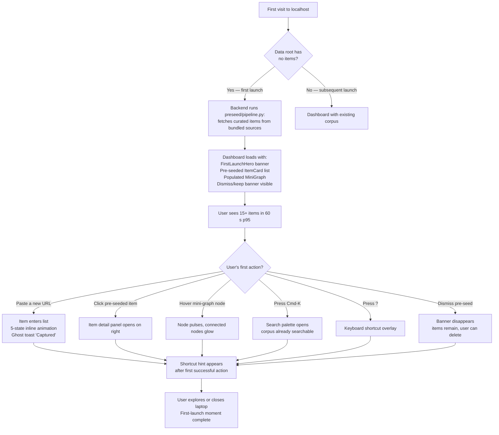
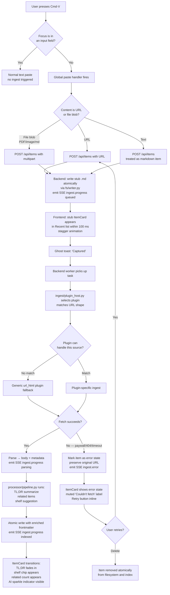
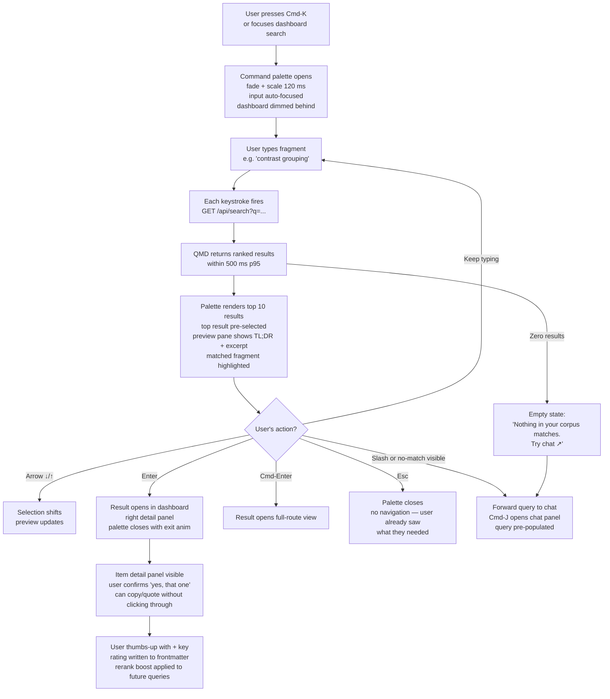
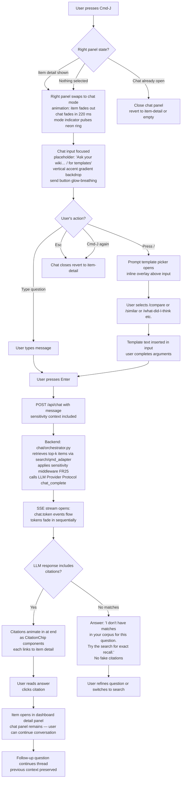
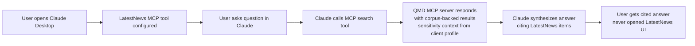
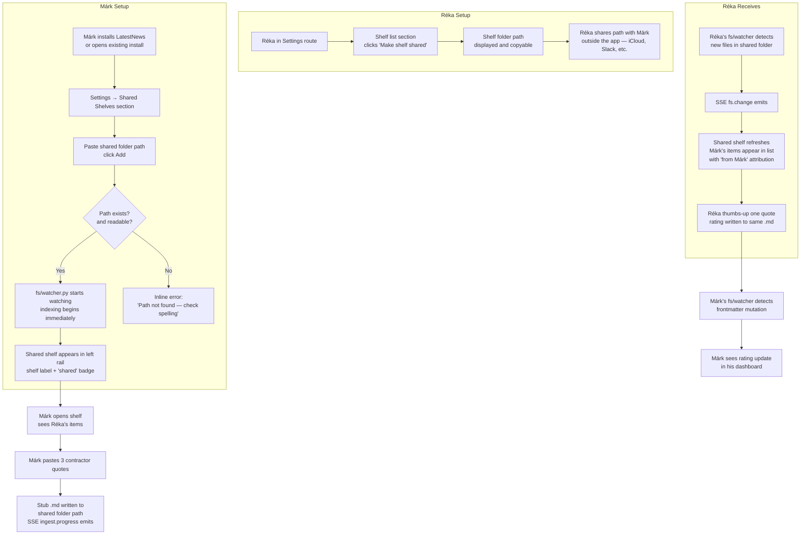

# UX Design Specification LatestNews

**Author:** csacsi
**Date:** 2026-04-17

---

<!-- UX design content will be appended sequentially through collaborative workflow steps -->

## Executive Summary

### Project Vision

**LatestNews** is a local-first, file-based personal knowledge application. The user pastes any content — X posts, YouTube videos, PDFs, images, links — and it becomes searchable markdown enriched with AI-generated summaries. The primary value is **rediscovery**: surfacing what the user has already seen and thought about, rather than finding new information. Secondary value is a chat panel that lets the user ask natural-language questions of their own corpus.

The UX must feel on par with well-funded consumer SaaS (Linear, Raycast, Arc, Superhuman). Visual polish and motion are release-gate requirements, not a post-launch polish pass — this is codified as NFR-V3 (an external reviewer must judge the product at that level before release). The product's core loop is paste-and-forget capture → ambient AI enrichment → rediscovery through search or chat. Every UX decision is evaluated against whether it preserves the "it just works" feeling of that loop.

### Target Users

**Primary — Réka pattern (single curious knowledge worker):**
- Mid-30s professional (product designer is the archetype; applies equally to researchers, founders, PMs, engineers).
- Consumes 30–50 pieces of content daily and loses 95% of it.
- Has already abandoned 3–6 "second brain" apps because capture friction killed the habit.
- Tech-savvy enough to install a local app and configure LLM provider API keys; not so tech-savvy that a CLI-first tool would be acceptable.
- Primary device: desktop / laptop (MacBook archetype). MVP does not target mobile.
- Primary usage context: active work sessions, occasional "I remembered something" moments in meetings or conversations.

**Secondary — Márk pattern (shared-shelf participant):**
- Partner / family member / small-team collaborator.
- Lower tolerance for friction than the primary user.
- Will use the app only if it demands nothing beyond "open, paste, close."
- Must experience shared-shelf onboarding as seamless — no login, no invite email, no account creation.

**Tertiary — Bence pattern (contributing developer):**
- Engineer who wants to extend the product with a new ingest plugin.
- Interacts with the **developer surface** (`AGENTS.md`, `plugins/`, tests), not the user-facing UI.
- Still relevant to UX in one way: the product's visible code quality is part of the brand for Réka's tech-literate friends who might peek at the repo.

### Key Design Challenges

1. **Two wow moments in one dashboard.** Rediscovery and chat are both #1/#2 differentiators. The dashboard must give each a first-class home without fighting for attention. Chat cannot feel like an afterthought; search cannot feel like an intermediate step to chat.

2. **Frictionless capture that never blocks.** The paste action must be single-handed and non-modal. Capturing three items in fifteen seconds is a documented journey. The UI must show progress without demanding attention — soft toasts, inline per-item states, no spinners.

3. **Never-empty state on first launch.** The pre-seeded corpus must feel like a working product, not a demo. The onboarding hero cannot be a tutorial; it must be the product already running.

4. **Ambient AI that feels honest, not magical.** TL;DRs, shelf suggestions, related items all happen automatically. The UI must signal "AI did this" without being loud about it, and make override trivial (FR11). If the AI is wrong once, the user must not feel trapped.

5. **Explore page that is beautiful and useful, not just beautiful.** The force-directed topic graph is where wow meets utility. It cannot be a marketing screenshot that is actually tedious to navigate. Every interaction (hover, click, filter) must be fluid and informative.

6. **Shared-shelf collaboration with zero account ceremony.** Multi-user is a journey (J5) but there are no accounts, no invites, no notifications in the app. Conflict resolution when two people edit the same item simultaneously must be a one-click decision, not a merge UI.

7. **Sensitivity signalling that is clear but not scary.** Every item carries a `personal` / `shared` / `publishable` field. The UI must make this visible and editable without turning the product into a permissions manager.

8. **Visual polish and motion at Linear / Raycast level on a one-week MVP.** The timeline is short; the bar is high. Design-token discipline and reusable motion primitives must carry most of the load — every component gets the polish for free, not per feature.

### Design Opportunities

1. **Rediscovery as a delight mechanic.** Most tools treat "I found the thing I saved" as expected. We can make it a small moment — subtle animation, confident typography, ownership cues ("you saved this in March"). Turns a utility interaction into something that reinforces the core value hypothesis.

2. **Ambient progress as a visual identity.** The ingest pipeline has legible states (queued → fetching → parsing → summarizing → indexed). Visualized inline on each item — not in toasts — this becomes a recognizable product signature (cf. Linear's state transitions, Superhuman's keystroke feedback). First-run users immediately see that "things are happening."

3. **Graph as a second home, not a novelty.** The Explore page, if it has the right entry points from the dashboard, becomes a natural second surface: cluster-browsing, relationship-spotting, "I didn't know I had that much on this topic." Differentiates against every flat-list knowledge tool.

4. **Chat as a conversational front door, not a tab.** The chat panel can be persistently accessible (keyboard shortcut, always-docked corner) so it becomes the default way to ask a fuzzy question. Treats chat as a search-augmentation, not a separate feature to discover.

5. **Pre-seed as a branding moment.** The curated starter content on first launch is an opportunity to set tone — what kinds of things does LatestNews think are worth saving? This is an editorial choice that doubles as UX: first impressions of both the aesthetic and the taste of the product.

6. **Sensitivity affordance with calm typography.** A `personal` badge that uses scale + color restraint (not shouty red warnings) conveys privacy without fear-mongering. Could become a subtle quality signal.

7. **Micro-delight on feedback.** 👍 / 👎 is a small action that happens often. Getting the tactile response right (scale, spring, color arc) pays dividends on every interaction across the product lifetime.

## Core User Experience

### Defining Experience

The defining experience of LatestNews is a **three-beat loop** the user traverses dozens of times a day:

**Beat 1 — Capture.** User sees content worth remembering, pastes it into the dashboard. Action takes ≤ 3 seconds; zero organizational decisions required; user returns to whatever they were doing.

**Beat 2 — Ambient enrichment.** In the background, the AI pipeline adds a TL;DR, suggests a shelf, finds related items, updates the index. The user does not watch this happen, but ambient UI signals (per-item state, soft toasts) confirm it did.

**Beat 3 — Rediscovery.** Sometime later — hours, weeks, months — the user types a fuzzy query or asks the chat panel a natural-language question. The right item surfaces. The user feels the wiki working for them.

Every feature serves one of these three beats. If a feature does not, it is out of scope. The loop is tighter than Notion's (no organization tax), faster than browser bookmarks (because it answers conceptual queries), and more private than cloud RAG tools (local-first by default).

**The single most important interaction to get right:** the paste-to-searchable path. If a paste ever feels slow, lost, or requires follow-up, the core value hypothesis is broken. Everything else is secondary to this.

### Platform Strategy

- **Primary platform:** desktop web app via browser-at-localhost, pointed at a local FastAPI backend. React SPA with React Router v7.
- **Input modalities:** mouse + keyboard. Keyboard-first for power use (capture, search, navigation); pointer for graph, item detail, and settings.
- **Viewport target:** 1280×720 minimum; optimized for 1440×900+ (typical MacBook screens).
- **No offline story.** The app runs against local services; the LLM provider call is the only network dependency and only at AI processing / chat time. No service worker, no offline caching layer in MVP.
- **No mobile / tablet in MVP.** Touch-first interaction is explicitly post-MVP per PRD scope decisions.
- **Browser matrix:** latest two stable majors of Chromium, Safari 17+, Firefox stable. No legacy browser fallbacks.
- **Device-specific capabilities leveraged:** clipboard API (for paste-anywhere capture), drag-and-drop File API, `prefers-color-scheme`, `prefers-reduced-motion`. No camera, no geolocation, no push notifications.
- **Theme:** light and dark at parity, with system-preference as the first-launch default.

### Effortless Interactions

Interactions that must feel like they cost the user nothing:

1. **Paste-to-capture.** **Cmd-V anywhere on the dashboard** starts the ingest — no modal, no shelf picker, no "are you sure?" confirmation. The global paste handler is active on any non-input surface of the dashboard; pasting into a chat input or search box behaves as normal text paste. A brief ghost-preview ("captured: …") confirms the capture landed without interrupting.

2. **Search-to-find.** **Cmd-K** opens the command-palette-style search surface; typing filters results live; Enter opens the first result; arrow keys navigate. Zero round-trip to click a button.

3. **Thumbs-up / thumbs-down.** On any item card or search result, one keystroke (for example `+` / `-`) records feedback without leaving the current view.

4. **Shelf assignment.** The AI suggests one. If the user accepts it (default, no action needed), it is taken. Overriding is one click on a shelf chip.

5. **Opening an item.** Single click from a list, single click from a graph node. No tab / panel / drawer mode-switching ceremony.

6. **Chat access.** A persistent shortcut (`Cmd-J`) opens the chat panel from anywhere in the app, regardless of current route. User never has to "navigate to chat."

7. **Theme switch.** Not a user action we optimize for, but the first-time default must be correct (follow system preference) so most users never touch the setting.

Each of these is a codified FR in the PRD; this section defines the *quality bar* they must meet, not the capability.

### Critical Success Moments

These are the moments where UX success is visible or invisible:

1. **First-launch moment.** User opens LatestNews for the first time. Within 3 seconds they must see a populated dashboard with pre-seeded content rendered, the Explore graph already showing nodes, and an implicit confidence that "this thing works." Empty states, loading spinners, or "set up your first shelf" dialogs on first launch are disqualifying.

2. **First-paste moment.** User pastes their first real URL. Within 10 seconds they must see the item become searchable, with a TL;DR visible, a suggested shelf applied, and at least one related-item link. If any of these is missing or late, the user's impression shifts from "magic" to "promising."

3. **First-rediscovery moment.** User returns days later, types a fragment, the right item appears in the top 3. This is the moment the core value hypothesis becomes personally real. If rediscovery misses on the first real attempt, the user's trust budget drops sharply and recovery is hard.

4. **First-chat moment.** User presses Cmd-J for the first time, asks a natural question about their own corpus, receives a cited answer. If the citation links work and the answer is drawn from their items (not generic), the secondary wow lands. If the citations are missing or the answer is generic, chat becomes a disposable feature.

5. **First-conflict moment (shared shelf).** The first time a filesystem conflict artefact appears in a shared shelf, the resolution card must make the situation legible in under 10 seconds. A confusing conflict UI here destroys confidence in the shared-shelf model.

6. **First-override moment.** User notices the AI mis-shelved an item. They override it. The override is instant, persistent, and the AI learns from it (via the feedback loop). If overriding feels fiddly or the user suspects the AI will just re-override, trust in the ambient AI is damaged.

### Experience Principles

The principles below govern every subsequent UX decision. When design trade-offs appear, these are the tiebreakers.

1. **Capture is sacred.** No feature, notification, confirmation, or interaction may stand between the user and a successful paste. Capture friction is the one thing that must never regress.

2. **Ambient, not attention-seeking.** The product does work in the background and shows quiet evidence. It does not demand attention to announce what it has done. Soft toasts, inline state, legible-but-not-loud animation.

3. **Rediscovery is the feature; search is the verb.** Interface metaphors lean into re-encounter ("you saved this in March") rather than novelty discovery. Search UI treats the user's own corpus as the primary universe, not an index to be crawled.

4. **One keystroke beats two clicks; two clicks beat a menu.** Every primary action has a keyboard path. Keyboard paths are documented and discoverable (shortcut hint in UI).

5. **Every visible element is token-derived.** No raw hex, no arbitrary pixel spacing, no ad-hoc shadow. Design tokens are the single source of truth for visual language. This principle makes polish scalable across the one-week build.

6. **Motion has meaning.** Animations communicate state change or causation; they do not decorate. An item sliding in means it was just captured; a node pulsing means it relates to the hover target; a token fade-in means the chat is synthesizing.

7. **Override must be trivial.** Every AI-generated field (TL;DR, shelf, related items) has a one-click correction path. The user is always the final authority.

8. **Private by default.** New items are `sensitivity: personal`. Any broader exposure is an explicit user decision. The UI makes sensitivity visible without being alarming.

9. **Empty states are not allowed to be empty.** Pre-seed content fills the first-launch state. Filtered views that return zero results explain why in one sentence and offer the next action (often: "nothing in your corpus matches — try chat?").

10. **Keyboard-first does not mean mouse-last.** Power users live in the keyboard; casual users live in the pointer. Every feature supports both cleanly.

## Desired Emotional Response

### Primary Emotional Goals

The emotional target for LatestNews sits in a specific quadrant of consumer-tool feelings. The product should make users feel — in order of priority:

1. **Quiet confidence.** "I captured it; it is safe; I will find it when I need it." Confidence without requiring the user to think about where, how, or when. The emotion sits below conscious attention; it is the feeling of trust rather than the thought "I trust this."

2. **Small, personal delight.** Not fireworks. Not marketing-deck wow. The kind of delight that comes from a tool working exactly as expected and then one notch better — a related item you forgot about; a graph cluster that surprises you; a citation that lands on the one item you were hoping it would.

3. **Competence.** The product makes the user feel more capable. Réka quoting a saved blog post in a design review, looking prepared — that feeling. Not "this tool is smart"; rather "I am smart because I have this tool."

4. **Calm focus.** The app is not another place that pulls attention. Capture is ambient, enrichment is silent, the UI does not ping or badge or nag. Users leave the app feeling no more depleted than when they arrived.

**Emotion that would make them tell a friend:** "You know how you see good stuff online and immediately forget it? I have this thing now where I paste anything and later I can just ask it questions about what I've read." The emotion in that recommendation is quiet pride, not breathless enthusiasm.

**Emotions to actively avoid:**

- **Anxiety.** No syncing conflicts presented scarily, no "you are using X% of your quota," no surveillance-vibes from the AI pipeline.
- **Decision fatigue.** No shelf-picker on capture, no tag taxonomy to maintain, no "how would you like to organize this?" prompts.
- **Bookmark-graveyard guilt.** The feeling of looking at Notion / Pocket and seeing hundreds of unread things. LatestNews must not accumulate weight.
- **Privacy unease.** Cloud LLM processing is fine, but the UI must be transparent about it (NFR-S4). Users should never feel surprised by where their data went.
- **Being impressed at the expense of being served.** A flashy Explore page that is fun for five minutes but doesn't actually help. A chat that is eloquent but not cited. Both are failures.

### Emotional Journey Mapping

| Moment | Desired emotion | Why this matters |
|--------|-----------------|------------------|
| First discovery (seeing LatestNews recommended) | Curiosity without skepticism-on-arrival | Previous "second brain" apps have burned the user; we need to differentiate within the first minute |
| First launch (pre-seeded dashboard appears) | Mild surprise → recognition | "It already works" breaks the abandonment pattern |
| First paste (watching ingest happen) | Quiet satisfaction | Confirms the promise: paste → searchable, no friction |
| First rediscovery (a fuzzy query returns the right thing) | Personal delight + competence | The core value hypothesis is personally validated; this is the ROI moment |
| First chat (asking a question, receiving a cited answer) | Surprise-then-trust | Secondary wow that amplifies the primary loop |
| Ambient ongoing use (weeks in, pasting routinely) | Calm ownership | The tool has become a background utility — the healthiest possible state |
| Something goes wrong (ingest fails, conflict artefact) | Handled, not alarmed | The failure state should feel like "oh, that; I can deal" rather than "something is broken" |
| Returning after a week away | Immediate reorientation | The dashboard state on return should make the user feel the corpus is theirs, not a strange machine they left behind |
| Sharing a shelf with a partner (secondary user) | Casual cooperation | No "collaboration ceremony" feel; the shelf just starts working |

### Micro-Emotions

Subtle states we want to get right because they compound across thousands of interactions:

**Cultivated:**
- **Confidence** — the user always knows what state the system is in (item captured? still processing? indexed? failed?). Legible state is a trust multiplier.
- **Trust in the AI overlay** — TL;DRs and related-item suggestions feel honest, not oversold. When the AI is wrong, the correction cost is near zero.
- **Ownership** — everything in the product belongs to the user. No "recommended for you" from an unknown editorial voice; no external signals.
- **Rhythm** — keystrokes, animations, and state transitions compose into a felt tempo that the user syncs with. Motion has meter.
- **Quiet belonging** (for shared shelf users) — contributing to a shared shelf feels like a small cooperation, not a published act.

**Actively suppressed:**
- **Performance anxiety** — no progress bars that stall, no "hurry up" messaging, no timeouts surfaced as user failures.
- **Over-cueing** — no tooltips covering already-obvious actions; no onboarding overlays that educate rather than get-out-of-the-way.
- **Gamification residue** — no streaks, no achievements, no badges. Thumbs-up is feedback, not a game mechanic.
- **Algorithm-anxiety** — the rerank boost from thumbs feels like the user teaching the tool, not the tool conditioning the user.

### Design Implications

Each emotional goal maps to concrete UX implementation directions:

| Emotion | UX mechanism |
|---------|-------------|
| Quiet confidence | Inline item state visible at all times; no blind paste-and-pray; soft-edge motion that signals "handled" |
| Small delight | Micro-animations on capture success, thumbs-up, and rediscovery-hit moments; citation reveal in chat; graph hover-pulse on related nodes |
| Competence | Fast, confident search results; citations that feel earned; typography that treats the user as literate (body text, not marketing voice) |
| Calm focus | Minimal chrome; no red dots; no modal interruptions; notifications as soft toasts that dismiss on their own; no attention-seeking elements on routes other than Dashboard |
| Trust in AI | Always show "AI generated" distinction (subtle tag on TL;DR and suggested shelf); one-click override everywhere; never silent rewrites |
| Ownership | User's name nowhere (it is their computer, their corpus); date / source / shelf visible on every item; no external "also viewed" style nudges |
| Rhythm | Consistent timing scale in motion system (e.g. fast 120 ms, base 220 ms, soft 360 ms); spring easing for anything physical (enter / exit / feedback), linear for anything mechanical (progress) |
| Avoiding anxiety | Errors framed as "try again" not "something is broken"; conflict UI uses neutral typography; sensitivity badge in muted tone, never red |
| Avoiding decision fatigue | One path through primary flows; keyboard does the work; AI makes suggestions, user accepts or dismisses one-key |
| Avoiding bookmark guilt | Inbox view shows recent captures without red-dot unread counts; no "you have 147 unreviewed items" — the corpus is the user's, not a todo |

### Emotional Design Principles

These are the affective counterparts to the experience principles from Step 3. When the visual design gets drafted later, these keep it from drifting into the wrong emotional register.

1. **Consumer tools can be restrained.** The Linear / Raycast / Superhuman aesthetic — tight typography, confident whitespace, muted color — is the default. No bright-pink CTAs, no illustration-heavy empty states, no playful mascot.

2. **Delight hides in timing, not ornament.** A button whose press has exactly the right spring curve is more delightful than a button with a rainbow gradient. Invest in motion and micro-states before investing in visual embellishment.

3. **Typography carries the tone.** One display-scale font, one body font (or one family with distinct weights); generous line-height; letter-spacing tuned for screens. Typography is the first thing users feel.

4. **Color is functional and atmospheric, not costume.** Token palette is small and semantic: surface, text, accent, semantic (success/warning/error). **Gradients are a first-class identity device** — dark-blue-to-green accent gradients appear on interactive affordances, hero surfaces, focus rings, and atmospheric backgrounds, in the spirit of Arc's space-gradient washes and Linear's brand moments. What we reject is costume gradients (rainbow, mascot-tinted hero banners, decorative tints on body copy). Our gradients always go between two related tokens within the accent family, never across the semantic palette.

5. **The AI speaks in the user's voice, not its own.** TL;DR phrasing is terse and literate, not chatty. Chat answers are direct, not explanatory. No "I think..." or "Great question!" — just the answer, cited.

6. **Errors are acknowledgments, not accusations.** "Couldn't fetch that URL — retry?" is correct. "Error 504: Upstream timeout" is wrong. "Something went wrong!" with a red exclamation is wrong in the other direction.

7. **Empty states are invitations, never apologies.** A filtered view with no results offers the next action without hand-wringing. "Nothing here yet — try chat, or paste something?" is the tone.

8. **Silence is a feature.** The default state is quiet. A single paste lands a single confirmation. Three pastes in 15 seconds land one combined confirmation, not three. Attention-economy restraint is a design act.

9. **The product does not congratulate the user.** No "Nice save!" on thumbs-up. No "You're on a streak!" on return. The tool is the quiet colleague who remembers everything, not the enthusiastic coach.

10. **Ambient polish compounds.** Every small interaction is worth getting right because the user will experience it hundreds of times. The hover state on an item card, the cursor caret in the search bar, the tab-focus ring — these are the texture of the product.

## UX Pattern Analysis & Inspiration

### Inspiring Products Analysis

The PRD's release-gate benchmark (NFR-V3) names four reference products: **Linear, Raycast, Arc, Superhuman**. Each solves a different slice of the LatestNews UX problem. Three additional products — **Obsidian, Notion, Mymind** — are studied for their direct category adjacency, with explicit notes on what to avoid.

**Linear** — project tracking for fast teams.
*What it does well:* tight typography (Inter / custom display), restrained color (single muted accent, functional semantic palette), confident whitespace, motion with purpose (state transitions animate; decoration does not), Cmd-K command palette as universal verb-entry, keyboard-first with discoverable shortcuts (`?` shows the map). Onboarding is a functional workspace, not a tutorial.
*What it teaches us:* the aesthetic ceiling of "consumer tools can be restrained"; how a command palette can be the product's spine rather than a power-user affordance; how to make keyboard-first feel inviting rather than hostile.

**Raycast** — keyboard launcher / command surface for macOS.
*What it does well:* Cmd-Space pattern (single entry, infinite depth), extension model (plugin-like commands discoverable in a directory), fuzzy search that feels psychic, calm result lists (one line per item, subtle metadata, instant preview panes). Its visual identity is the absence of visual identity — minimum chrome, maximum information density.
*What it teaches us:* how to make search feel like thought rather than query; result list typography and rhythm; extension-system UX for a similar plugin model on our side.

**Arc** — reimagined browser.
*What it does well:* confident design decisions that break convention (vertical tabs, spaces, easels) without gimmick; motion with weight and purpose; brand voice that is literate but never precious; dark/light theme work that neither feels grafted-on. First-launch onboarding introduces novel concepts quickly without over-teaching.
*What it teaches us:* how to take a strong point of view (rediscovery > search) and express it visually; how motion can carry the product's personality; how to use color restraint while still feeling alive.

**Superhuman** — keyboard-driven email client.
*What it does well:* keystroke feedback that lands instantly (no perceptible lag, no animation that gets in the way), split-panel layouts that keep reading context visible, empty-state and done-state moments (Inbox Zero) that feel earned rather than congratulatory. Their entire product is about "the tempo of the keyboard."
*What it teaches us:* how to make thumbs-up / thumbs-down / capture / navigate feel like playing an instrument; how to cue success without gamifying it.

**Obsidian** — local-first markdown notes with graph view.
*What it does well:* filesystem-as-truth treated as a feature, not a technicality; graph view as a secondary surface that actually gets used (not a marketing screenshot); plugin ecosystem with a tone of "power user, not gamer."
*What it teaches us:* how a local-first app communicates ownership; graph interaction patterns (zoom, pan, filter, cluster focus); how to write plugin docs that don't condescend.
*Where it fails for our audience:* blank-canvas intimidation ("what do I organize?"), capture friction (plugin-dependent), generic UI that does not meet the Linear / Arc polish bar. We want its architecture, not its aesthetic.

**Notion** — database-y productivity platform.
*What it does well:* inline blocks, /-command menu as a near-universal verb, linked references, database views.
*What it teaches us:* the `/` command pattern adapts directly to chat-starter templates ("/compare", "/similar"). The linked-reference model informs related-items UI.
*Where it fails for our audience:* decision-fatigue at setup, heavy structure up front, empty-state tax. We want none of the "how would you like to organize this?" prompts.

**Mymind** — tagless visual rediscovery tool.
*What it does well:* the category-adjacent pitch is almost identical ("remember everything without organizing"), visual/card-based capture, AI-assisted recall.
*What it teaches us:* proof that the rediscovery-first positioning can carry a product; AI-assisted UX cues (suggested tags, auto-grouping) that stay out of the user's way.
*Where it differs / where we compete:* cloud-only, subscription, closed; no MCP surface, no developer extensibility, no shared-shelf path. We are the local-first, extensible answer to the same problem.

### Transferable UX Patterns

Patterns lifted from the reference products, with explicit claim on how they map to LatestNews surfaces.

**Navigation patterns**

- **Cmd-K command palette (Linear, Raycast).** Our primary search surface. Opens over any route; accepts typed query, fuzzy-matches against corpus + routes + actions; arrow-key navigation; Enter to commit. Becomes the app's universal verb-entry.
- **Persistent chat shortcut (`Cmd-J`) that overlays the current route.** Chat panel slides in from the right, does not replace the current view. Closes with Esc or re-pressing Cmd-J.
- **Vertical split layouts (Superhuman, Arc).** Dashboard: left rail for shelves / inbox, center pane for item list / search results, right pane for item detail (when opened). Predictable spatial model; nothing jumps.
- **Minimal top chrome (Linear, Arc).** Route indicator + profile-less user state + keyboard-shortcut hint. No logo bar, no navigation tabs consuming vertical space.

**Interaction patterns**

- **Instant keystroke feedback (Superhuman).** Every primary keystroke has an < 80 ms visible effect, even if the network hasn't confirmed. Optimistic UI with graceful reconciliation. Thumbs-up, shelf move, delete, mark-done all follow this.
- **Progressive disclosure in item detail (Notion, Linear).** The item detail panel shows TL;DR and source prominently; "related items" and "edit frontmatter" are one click away but not loud; the raw markdown body is scrollable below the fold.
- **Fuzzy-search-as-you-type with inline preview (Raycast).** Search results update on every keystroke; first result is pre-selected; a preview pane shows the selected item's detail without committing to a navigation.
- **Graph hover-pulse (Obsidian + a layer of Arc's motion discipline).** Hovering a node in the Explore graph subtly highlights connected nodes with a synchronous pulse animation — ambient, not flashy.
- **`/`-command chat templates (Notion).** Typing `/` in the chat input opens a quick picker of starter templates (`/compare`, `/similar`, `/what-did-I-think`). Implements FR23 as an in-place shortcut rather than a separate UI.

**Visual patterns**

- **Semantic color tokens with restraint (Linear, Arc).** Background-primary / background-elevated / text-primary / text-muted / text-subtle / accent / semantic (success, warning, error) — that's the whole palette. No decorative tints.
- **Typography that respects the reader (Arc, Linear).** **Inter** as the single type family (display and body at distinct weights); confident line-heights and letter-spacing tuned for dark and light themes separately. Inter is chosen over alternatives (Geist, Söhne) for zero licensing friction, mature rendering across platforms, and proven legibility at small sizes.
- **Generous whitespace (Linear, Superhuman).** Item rows are not dense; they breathe. The product feels premium at the cost of vertical density.
- **Single accent color, used sparingly (Arc, Raycast).** One brand hue for focus, selection, and interactive affordances. Not for decoration, not for mood-setting.

**Motion patterns**

- **Three-tier timing scale (Linear-inspired).** Fast (120 ms, hover / focus), base (220 ms, enter / exit / toast dismiss), soft (360 ms, layout shift / route transition). Every animation uses one of these three durations.
- **Spring easing for physical actions, linear for progress (Superhuman).** Thumbs-up scales with a spring; ingest progress bar fills linearly. Mismatch signals "the system is lying to me."
- **Layout animations for state change (Arc, Linear).** When an item's state changes (queued → indexed), the card transitions inline rather than disappearing and reappearing. Spatial continuity preserves the user's mental model.
- **Motion lives in tokens (Motion library + Tailwind).** Variants (`enter`, `exit`, `settle`, `pulse`, `press`) are defined in `web/src/design/motion.ts` and composed across the app; no per-feature ad-hoc animation.

**Onboarding patterns**

- **Pre-populated workspace (Arc, Linear on team invite).** First-launch shows a working state, not an empty one. Our pre-seed corpus does this.
- **Shortcut hint after first successful action (Superhuman).** Right after the user pastes and sees their first ingest complete, a non-modal hint surfaces "You can press Cmd-V anywhere" or "Try Cmd-K to search." Dismisses on acknowledgment; never repeats.
- **`?` overlay for keyboard-map discoverability (Linear, Superhuman).** Pressing `?` anywhere in the app reveals a keyboard-shortcut map as a calm overlay with dismiss-on-Esc behaviour. The map also links to `AGENTS.md` for deeper discoverability. Power-user discoverability without onboarding overlay burden.

### Anti-Patterns to Avoid

Patterns that surface in the category — sometimes in direct competitors — that actively undermine our emotional goals.

**From knowledge-management space:**

- **Empty-canvas onboarding.** "Create your first workspace / shelf / tag" as the first screen (Notion, Obsidian default). Violates "never-empty-state" principle.
- **Capture-time taxonomy.** "What folder / tag should this go in?" on paste. Violates "capture is sacred."
- **Unread-count badges.** Red dots on shelves indicating "you have 47 unreviewed items" (Readwise, Pocket). Converts the corpus into a todo list; violates "no bookmark-graveyard guilt."
- **Gamification layers.** Streaks, achievements, "you saved 100 items!" popups. Violates "the product does not congratulate the user."

**From AI-in-UX space:**

- **Chatty AI voice.** "I'd be happy to help you find..." / "Great question!" / "Here are some thoughts..." Violates "AI speaks in the user's voice."
- **Magic without override.** AI-generated fields that can't be easily corrected, or auto-correct themselves back after user edits. Violates "override must be trivial."
- **AI as sole surface.** Replacing search with chat and hiding the underlying corpus. Chat augments; does not replace.
- **Hallucination without attribution.** Chat responses that sound plausible but cite nothing. Every chat answer must cite or explicitly say "no matches in your corpus."

**From general consumer-app space:**

- **Modal-heavy flows.** Every action opens a modal, every modal has a Save button. Violates "one keystroke beats two clicks."
- **Decorative illustrations and costume gradients.** Whimsical characters for empty states, mascots, or rainbow / multi-hue hero gradients. (Note: atmospheric accent gradients *within* our dark-blue-to-green brand family are part of our visual identity, not a violation — see the Color principle. The line is rainbow vs. tonal, mascot vs. atmospheric.) Violates "consumer tools can be restrained."
- **Progress spinners as primary state indicator.** A generic spinner with no context. Violates "ambient, not attention-seeking" — our pipeline has five legible states.
- **Toast overload.** Every action emits a toast; toasts stack up; user has to dismiss them. Violates "silence is a feature."
- **Scary error dialogs.** Red modals with "Error! Something went wrong!" Violates "errors are acknowledgments, not accusations."

### Design Inspiration Strategy

**What to adopt (verbatim where licensing allows, by convention otherwise):**

- Cmd-K command palette shape and keyboard-first navigation model (Linear / Raycast).
- Three-tier motion timing scale (Linear).
- Vertical split-pane dashboard layout (Superhuman / Arc).
- Fuzzy-as-you-type search with inline preview (Raycast).
- Graph hover-pulse on connected nodes (Obsidian + motion polish from Arc).
- Restrained semantic color palette with single accent (Linear / Arc).
- Optimistic UI with < 80 ms keystroke feedback (Superhuman).
- `?` overlay for shortcut discoverability (Linear / Superhuman).
- Pre-seeded starting state (Arc onboarding).
- `/`-command menu for chat prompt templates (Notion).
- Inter as the single type family.

**What to adapt:**

- Linear's command palette primarily routes to actions; ours routes primarily to corpus items (with actions secondary). The weight inverts.
- Obsidian's graph view is an exploration toy; ours is a navigation tool with click-to-open and filter-by-shelf as first-class.
- Raycast's extension model inspires our plugin UX discoverability, but plugins are Python files in `plugins/`, not a visual marketplace.
- Notion's `/`-command is a block inserter; ours is a chat-prompt starter. Same keystroke, different semantic.

**What to avoid (non-negotiable):**

- Every anti-pattern listed above.
- Any branding choice that reads as "startup logo" rather than "software for adults."
- Cloud-first visual cues (sync spinners, "saving…" labels, "stored in the cloud" reassurances) — they would contradict our local-first positioning.
- Social-media-style novelty nudges (red dots, "X new items," "streak preserved"). These do not belong in a tool for ambient knowledge work.

## Design System Foundation

### Design System Choice

**Approach: themeable foundation with deep customization.** A three-layer stack:

1. **Primitive layer — Radix UI.** Unstyled, accessible, keyboard-perfect behaviour primitives for Dialog, Dropdown, Popover, Tabs, Tooltip, Combobox, ScrollArea, Toast, and a dozen others. Radix owns focus management, keyboard handling, ARIA, and the hard interaction-state problems (open, closed, hover, focus-visible, disabled). We never rebuild these from scratch.

2. **Component layer — shadcn/ui.** A copy-paste component library that wraps Radix primitives with baseline Tailwind styling. Components live *in our repo* (`web/src/components/ui/`) — not in `node_modules`. We edit them freely; upstream updates are opt-in diffs, not forced breakages.

3. **Token and motion layer — custom, fully owned.** `web/src/design/tokens.css` (CSS custom properties, single source), `web/src/design/theme.ts` (Tailwind `@theme` mapping), `web/src/design/motion.ts` (Motion variants and timing scale), `web/src/design/typography.ts` (Inter scale). This is where our identity lives and where the Linear / Arc-level polish is expressed.

This is **not** a pure custom system (too slow for MVP), **not** a pure off-the-shelf system (Material / Ant would cap us below the quality bar), and **not** a themeable library in the MUI / Chakra sense (their baseline aesthetic drags toward a generic SaaS look we are trying to avoid).

### Rationale for Selection

- **Quality ceiling matches the NFR-V3 benchmark.** Radix + shadcn/ui is exactly the stack used by Vercel, Linear-adjacent products, and numerous production consumer apps; its ceiling is proven to clear the Linear / Raycast / Arc bar. MUI or Ant Design have visible generic ceilings that the benchmark products have all avoided.
- **Accessibility built in at the primitive layer.** Radix handles keyboard, focus, and ARIA correctly across all primitives, hitting NFR-A1–A5 with zero per-component effort. shadcn/ui's Tailwind styling preserves Radix's a11y behaviour.
- **Copy-paste model is architecturally correct for us.** Components in our repo, not a versioned dependency, match the product's "reference-grade engineering" posture. A developer reading the codebase can see every component's implementation without `node_modules` spelunking.
- **Zero-override tax.** With shadcn/ui the defaults are already minimal; our tokens replace them at the root level and cascade through every component.
- **Tailwind v4 alignment.** Tailwind v4's `@theme` directive makes CSS-custom-property-based tokens first-class. Our tokens are Tailwind's tokens; there is no parallel design-token-vs-utility-class tension.
- **Speed within the one-week MVP.** Pre-built components save hours versus hand-rolling. At MVP scale this compounds — we ship polished components from day one, and every hour we save on component construction goes into motion polish and rediscovery tuning.

### Implementation Approach

**Component inventory — what we install from shadcn/ui and what we build.**

**Installed from shadcn/ui (via the CLI, committed to the repo):**

- Button, Input / Textarea, Dialog / Modal, Dropdown menu, Tabs, Tooltip, Popover
- Command (the Cmd-K palette primitive — built on cmdk)
- Toast (Sonner under the hood)
- ScrollArea, Separator, Avatar, Sheet (for the chat panel slide-in), Skeleton, Switch, Select, Label
- Form (react-hook-form + Zod adapter)

**Components we build on top (in `web/src/components/`, not `ui/`):**

- **ItemCard** — item row with TL;DR, state, shelf, sensitivity, thumbs.
- **IngestStatusInline** — the five-state pipeline indicator.
- **CitationChip** — a chat-citation link with hover preview.
- **ShelfChip** — a shelf tag with AI-suggestion indicator and one-click override.
- **SensitivityBadge** — calm pill (personal / shared / publishable) using muted tokens.
- **ForceGraphCanvas** — react-force-graph wrapper with our motion and theme tokens applied.
- **PreSeedBanner** — the "starter content" banner for first launch.
- **ConflictResolutionCard** — one-click conflict resolution for shared shelf artefacts.

**Motion layer.** Motion library for component-level animations (enter, exit, layout, variants). Tailwind utilities for simple transitions. `web/src/design/motion.ts` exports canonical variants (`enter`, `exit`, `settle`, `pulse`, `press`, `stagger`) and three durations (`fast: 120 ms`, `base: 220 ms`, `soft: 360 ms`).

**Iconography.** Lucide as the single icon family, tree-shakeable. Icon size scale locked to the spacing system (12 / 16 / 20 / 24). No mixed icon families; no emoji in shipped UI.

**Typography.** **Inter**, self-hosted via `@fontsource/inter`. Single family, **four weights**: 400 (body), 500 (emphasis / labels), 600 (UI headings), 700 (display). Display scale (5 sizes), body scale (4 sizes), mono scale (2 sizes — source URLs, code). Line-heights tuned per scale. All sizes expressed as tokens.

### Customization Strategy

**What we keep from shadcn/ui defaults:**

- Behavioural wiring (Radix handles it).
- Markup structure.
- Props interface.

**What we replace at component install time:**

- Color values — every `bg-*`, `text-*`, `border-*` rewritten to semantic tokens.
- Radius scale — single `--radius-md: 8px` used consistently (Arc-inspired, slightly softer than Linear's sharper 6 px); shadcn's per-component radii removed.
- Shadow and elevation — our `--shadow-*` tokens used; shadcn's default shadows removed.
- Motion — shadcn's default CSS transitions replaced with Motion variants from our token set.
- Font — explicitly apply Inter via the base layer.

**What we extend beyond shadcn/ui:**

- The custom-built component list above.
- Theme switching (light / dark / system) as a first-class hook and route-level provider.
- A shared `app-shell/Toasts.tsx` wrapper that pins notification styling to our token system with muted-by-default variants.

**Versioning and upgrade discipline.**

- `components.json` records the shadcn/ui style config; re-running the CLI with `--overwrite` requires a PR.
- Upstream shadcn/ui updates are reviewed as opt-in diffs (`npx shadcn@latest diff <component>`). Our overrides are preserved.
- Radix is pinned via shadcn/ui's dependency chain. Radix's own release cadence is slow and stable; no automated major-version bumps.

### Identity Direction — Color and Gradient Language

The brand's visual identity is built on a **dark-blue-to-green accent family** with **tonal gradients as a first-class device** — atmospheric, not decorative. This is the LatestNews character: a depth-of-ocean palette that reads as calm, literate, and technically serious (the emotional fit for a knowledge tool).

**Accent family (concrete values to be specified in Step 8):**

- `--color-accent-deep` — deep navy / dark teal. The brand's anchor colour. Used for primary interactive states at rest.
- `--color-accent-mid` — mid teal-green. Used for hover, active focus, and the "hot side" of gradients.
- `--color-accent-glow` — brighter teal-green (the green half of the dark-blue-to-green arc). Reserved for focus rings, citation hover state, and gradient highlights.
- `--color-accent-subtle-bg` — very low-saturation tint of the accent family for subtle backgrounds (selected row, active tab, pre-seed banner).
- `--color-accent-subtle-text` — the readable text counterpart of the subtle background.

**Where gradients appear:**

- **Primary CTA backgrounds** — subtle dark-blue-to-green diagonal (e.g. 135 deg, accent-deep → accent-mid). Used on the capture submit button, primary action in empty states.
- **Focus rings** — not a flat ring colour but a narrow 2-stop accent gradient. Elevates the "selected" feel without gimmick.
- **Route hero surfaces** — first-launch banner, Explore page header, onboarding moments — carry an atmospheric gradient that suggests depth. Think Arc's space-background gradient dialled toward ocean tones.
- **Chat panel background** — a nearly-imperceptible vertical accent-subtle-bg gradient that differentiates the chat surface from the main content without being loud.
- **Graph node glow (Explore page)** — hovered nodes gain a subtle accent-glow pulse; clustered nodes share a tonal gradient tint by shelf.
- **Hero motion moments** — the onboarding Lottie / Motion hero uses the accent gradient in a short, restrained way during first paint.

**Where gradients do NOT appear:**

- Body text. Ever.
- Card backgrounds for individual items (stays on flat surface tokens for legibility).
- Toasts and small notification surfaces (flat, muted).
- Settings page (intentionally plain, operational feel).
- Semantic colour surfaces (success / warning / error stay flat for legibility at a glance).

**Dark vs. light theme gradient behaviour:**

- Dark theme leans into the identity: deeper navy base, richer blue-to-green gradients, slightly more gradient surface area.
- Light theme is more restrained: accent gradients become more subtle, lower-contrast versions of the same accent family. The green side may desaturate further so the page does not compete with text legibility.
- Both themes share the same token names; only the values shift.

**Non-accent colors remain flat and functional.**

Surface, text, border, and semantic palettes are solid colours — no gradients. Gradients live exclusively within the accent family. This keeps the visual system legible while giving the product its identity signature.

### Token System Structure

A preview of the token architecture that Step 8+ will fill in with actual values.

**Color tokens (semantic, not primitive):**

- `--color-surface-primary` / `-secondary` / `-tertiary` / `-overlay`
- `--color-text-primary` / `-muted` / `-subtle` / `-inverted`
- `--color-border-subtle` / `-default` / `-strong`
- `--color-accent-deep` / `-mid` / `-glow` / `-subtle-bg` / `-subtle-text` (and hover / pressed variants)
- `--gradient-accent-diagonal` / `-vertical` / `-radial-glow` (pre-composed gradient tokens)
- `--color-semantic-success` / `-warning` / `-error` / `-info` (and subtle-bg / subtle-text variants for each)

Light and dark themes each define the entire set under `[data-theme='light']` and `[data-theme='dark']`. `prefers-color-scheme` is the first-launch default.

**Spacing tokens (4 px base):** `--space-0` through `--space-24` (0, 2, 4, 6, 8, 12, 16, 20, 24, 32, 40, 48, 64, 80, 96 px equivalents).

**Radius tokens:** `--radius-sm: 4px` / `--radius-md: 8px` / `--radius-lg: 12px` / `--radius-full: 9999px`. The default for interactive surfaces is `--radius-md` (Arc-inspired).

**Shadow tokens:** `--shadow-subtle` / `-elevated` / `-overlay`.

**Typography tokens:** `--font-family-sans: 'Inter', sans-serif` / `--font-family-mono`. `--font-weight-regular: 400` / `-medium: 500` / `-semibold: 600` / `-bold: 700`. `--font-size-*` and `--line-height-*` tokens matched to a type scale defined in Step 8.

**Motion tokens:** `--duration-fast: 120ms` / `-base: 220ms` / `-soft: 360ms`. `--easing-spring` (Motion spring preset) / `-linear` / `-standard` (cubic-bezier).

**Focus and interaction tokens:** `--ring-width: 2px`, `--ring-color` (references accent gradient), `--ring-offset: 2px`. `--opacity-disabled: 0.5` / `-hover: 0.9`.

Concrete values for all tokens will be specified in Step 8 (Visual Design Foundation) and implemented in `web/src/design/tokens.css`.

### Key Decisions Locked in This Step

- **Radius default: 8 px** (Arc-softer over Linear-sharper 6 px).
- **Typography: Inter, 4 weights** (400, 500, 600, 700).
- **Accent family: dark-blue-to-green** (deep navy → teal → bright teal-green), with tonal gradients as a first-class identity device (not merely decoration).
- **Gradient restraint: within-accent-family only.** Functional surfaces (text, cards, toasts, settings, semantic colours) stay flat.
- **Earlier "color is functional, not decorative" principle updated** (see Emotional Design Principle 4) to reflect this gradient-inclusive identity while preserving the anti-gimmick stance.

## 2. Core User Experience

### 2.1 Defining Experience

**The defining experience of LatestNews is a successful rediscovery: the moment the user types a fragment of something they saved weeks ago, and the right item surfaces in the top 3 results.**

When Réka describes the product to a friend, this is what she describes. "You know how you see a brilliant tweet and immediately forget it? I have a thing now where a month later I can half-remember it and my wiki just finds it." The emotion is recognition + quiet competence; the mechanic is fragmentary query → precise surfacing.

A subtlety worth naming: **capture is the gatekeeper defining experience** (without frictionless capture, the corpus never grows to a point where rediscovery can work), but **rediscovery is the emotional defining experience** (the moment that makes the product feel real). Both must work. If forced to pick the one-sentence product definition, it is the rediscovery moment.

Every other interaction in the app supports one of three roles:
- It **enables rediscovery** (capture, ambient AI processing, feedback loop).
- It **extends rediscovery** (chat as a fuzzier retrieval surface; Explore graph as a visual retrieval surface).
- It **preserves the conditions for rediscovery** (sensitivity filtering, shared shelves, plugins, onboarding).

If a proposed feature does none of these, it does not belong in LatestNews.

### 2.2 User Mental Model

**How users currently solve this problem.** Badly. They rely on a patchwork of browser bookmarks, Apple Notes, Notion databases, saved tweets, Pocket queues, "reading list" folders, and "just Google it again later." Each has a failure mode: bookmarks are write-only, Notes is searchable but unstructured, Notion requires organization-on-save, Pocket collects but doesn't connect, Google can't search the user's private context. The user's mental model, after years of this patchwork, is "I will probably lose this but I'll try anyway."

**The expectation users bring.** They expect:
- Any save to succeed quickly (bookmarks set this baseline).
- Some amount of structure to be their problem (Notion set this expectation).
- Search to work like Google (text matching) rather than like memory (conceptual matching).
- Chatting with their own notes to be an advanced/future feature.

**What we have to break (gently).** Two of those expectations are wrong for our product:

1. **Structure is not the user's problem.** Capture without tagging, shelving, or titling must feel fine, not fragile. The user's mental model needs to adjust from "I'll organize it later" to "the system will handle this."

2. **Search works on meaning, not just text.** When the user types "contrast grouping," they should not expect exact-string matches; they should expect the tool to understand they are recalling a design principle they read about. This requires the UI to telegraph confidence — "we understand your vague query is the point."

**The mental-model mismatch most likely to cause early abandonment.** Réka pastes three things on day one, closes the app, comes back a week later, types "that thing about contrast," gets zero or wrong results, concludes the tool is a gimmick, stops opening it. The user's rediscovery-first mental model takes weeks of usage to form; the tool must not fail them in the interim. This is why the pre-seeded corpus matters so much — it inflates the corpus to a point where rediscovery has signal to work with before the user has personally invested.

**What users will not need to learn.** The following are familiar enough that we do not need to educate:
- Paste / drag-drop (universal).
- Cmd-K command palette (ubiquitous in modern SaaS).
- Dashboard / sidebar / detail-panel layout (conventional).
- Thumbs-up / thumbs-down (universal).

**What users will need to learn (in small, painless doses).** The following require one-shot learning via subtle in-product cues:
- **Cmd-V anywhere** starts a capture even without an input focused. (Surfaced via the shortcut hint after the first successful paste.)
- **Cmd-J** opens chat from any route. (Surfaced the same way.)
- **`/` in chat** opens the prompt template picker. (Surfaced the first time the chat is used.)
- **Sensitivity defaults to `personal`** and can be changed per item. (Surfaced when the user first makes a shelf `shared`.)
- **`?` anywhere** shows the full shortcut map. (Surfaced in the first-launch hint banner.)

Each of these is a small adjustment, not a paradigm shift. The user's prior mental model mostly works; we extend rather than replace it.

### 2.3 Success Criteria

**Rediscovery is successful when:**

- The user types ≤ 4 characters and sees the right item in the visible results (not scrolling required).
- The result renders with enough context (title, date, source, excerpt with matched phrase highlighted) that the user confirms "yes, that one" without clicking through.
- Total time from "I want to remember X" → user has X visible on screen is ≤ 3 seconds at typical corpus size (500 items).
- If the top result is correct, the user feels *recognition*, not relief. Relief suggests the tool almost failed; recognition is the target emotion.
- If the top result is wrong, the user has an obvious and immediate path to chat (which uses different retrieval) without re-typing their query.

**Capture is successful when:**

- The paste action takes ≤ 3 seconds of the user's attention before they can return to the source of whatever they were doing.
- The paste produces a visible artefact (inline item in the recent list) within 500 ms, even if AI enrichment takes longer.
- The item is searchable (plain-text index hit) within 5 seconds; enriched (TL;DR visible) within 10 seconds.
- The user has not been asked to make any decision — no modal, no shelf prompt, no tag field.
- If the paste fails (paywalled URL, 404), the item still appears in the inbox with a clearly-marked error state and a retry affordance.

**The combined loop is successful when:**

- A first-time user, after 48 hours and ≥ 10 captures, correctly retrieves at least one item via fragmentary query (regression-suite threshold: ≥ 4 of 5 gold queries hit top-3).
- At 30 days, the user has made ≥ 30 captures and uses the app ≥ 5 of 7 days in a typical week (PRD Business Success targets).
- The user has not reverted to a previous tool or added parallel tools to cover LatestNews' gaps.

### 2.4 Novel vs. Established Patterns

**Established patterns we rely on (zero user education required):**

- Dashboard + sidebar + detail panel spatial model (ubiquitous).
- Cmd-K / fuzzy search (Linear, Raycast, GitHub, Notion, etc.).
- Paste / drag-drop capture (universal).
- Thumbs-up / thumbs-down feedback (universal).
- Tabs, modals, tooltips, dropdowns (Radix primitives; conventional behaviour).
- Dark / light theme toggle (universal).

**Modest innovations built on familiar ground (cued by in-product hints, not tutorials):**

- **Cmd-V anywhere to capture.** Familiar gesture (paste) in a slightly expanded scope (anywhere, not just in an input). Revealed by a shortcut hint after the first successful paste.
- **`/` in chat for prompt templates.** Notion's verb-menu pattern reused in a chat surface. Intuitive on first try; surfaced via placeholder text in the chat input.
- **`?` for keyboard map.** Linear / Superhuman convention.

**Genuinely novel interaction patterns (few; introduced with care):**

- **Ambient ingest-state visualization.** The five-state pipeline rendered inline on each item (queued → fetching → parsing → summarizing → indexed) is mildly novel — most apps hide this behind a spinner. Our version communicates state without requiring user attention. No education needed if done well; the states are self-explanatory visually.
- **Explore graph as a navigation tool.** Obsidian's graph is a curiosity; ours is a first-class route. Introduced via the pre-seed first-launch, where the graph is already populated and immediately clickable. The user discovers its utility through use, not onboarding.
- **Sensitivity as a calm pill, not a permission dialog.** Showing `personal` / `shared` / `publishable` as a muted badge on each item (without shouty color) is a departure from standard privacy UIs. Users understand it on first encounter because the pill labels are literal.
- **Shared shelves without accounts.** The secondary user (Márk) adds a folder path in settings and sees a shared shelf appear. There are no invite emails, no login, no "accept access." This is novel — but the education cost is low because the user sees it work immediately; the absence of ceremony is the surprise.

**No novelty for novelty's sake.** Every novel pattern above is driven by a specific emotional or product goal, not by a desire to look different. Our visual identity (the gradient language) carries most of the novelty weight; our interaction patterns are mostly familiar.

### 2.5 Experience Mechanics

**The rediscovery moment — step by step.**

**1. Initiation.**

The user triggers rediscovery in one of three ways:
- **Cmd-K from anywhere** (most common). A palette overlay opens centred, search input auto-focused, dashboard dimmed behind. The palette appears with a 120 ms enter animation (fade + slight scale), predictably framed by the spring-easing tuned in the motion system.
- **Typing into the dashboard search bar** (direct, no keystroke required if already on Dashboard). Results render inline below the bar.
- **Cmd-J for chat**, which is a different retrieval surface but serves the same rediscovery intent when the user's query is too vague for search.

In all cases: the initiation is a single keystroke or gesture. No prior navigation required.

**2. Interaction.**

The user types. With each keystroke:
- Search kicks off immediately; results update in < 300 ms at typical corpus size (NFR-P2 budget).
- The top result is pre-selected (highlighted, not committed). Arrow keys adjust selection. Enter commits.
- A preview pane shows the selected result's TL;DR, source, shelf, date, and the excerpt containing the best-matched fragment with the fragment itself highlighted.
- Shortcut hint at the bottom of the palette: "⏎ open · ⌘⏎ open in detail pane · / chat this · Esc close."

The interaction never blocks on the network or on the LLM. Live-filter is local / QMD-backed; preview is local; only chat crosses the LLM boundary, and only on explicit Cmd-Enter or `/`.

**3. Feedback.**

Success feedback layers:
- **Result appears** in the top-N position with visible rank and score cues (subtle, not a loud number).
- **Matched fragment** highlighted in the excerpt: accent-subtle-bg behind the phrase.
- **Ownership cues** in the result row: "saved 3 months ago from X," "also in `AI Tools` shelf." These are not noise; they are the confidence signal.
- **Keyboard rhythm** — the palette / preview updates smoothly with each keystroke; no jank, no layout shift.

Failure feedback layers:
- **No results** — a non-apologetic message: "Nothing in your corpus matches. Try the chat — it uses different retrieval." The `/` CTA is embedded, one keystroke away.
- **Wrong top result** — user can press ↓ to check alternatives. If none are right, the "try chat" path is always one keystroke below the list.
- **Slow result** (rare, but possible at larger corpus) — skeleton rows render while computing; never a spinner.

Error feedback (rare) — if the search backend is down for any reason: "Search unavailable — retry or try chat." Errors are acknowledgments, not accusations.

**4. Completion.**

The user presses Enter. One of three paths:
- **Default (Enter)** — the result opens in the detail panel on the right of the dashboard. The palette closes with an exit animation mirroring the entry. The user can skim the full item.
- **Cmd-Enter** — open in a dedicated route with full markdown rendering.
- **No commit (Esc)** — the palette closes. The user already saw what they needed in the preview; no click-through required. This is the power-user exit.

Post-commit: the item's `last_accessed` timestamp updates silently (feeds rerank boost; user is not informed). The palette history remembers the last 10 queries for quick re-access. The user returns to the source of their original task (Slack, document, meeting) with the right answer.

**The capture moment — step by step (gatekeeper experience).**

**1. Initiation.**

Three paths, any of which works from any route in the app:
- **Cmd-V anywhere** on a non-input surface.
- **Paste into the capture input** on the dashboard (already focused by default on dashboard load).
- **Drag-and-drop** a file onto any non-input surface of the dashboard.

The global paste handler is suppressed when focus is inside a chat input, search box, or any form field — in those cases paste behaves as normal text paste. Discriminating these cases requires modest but well-documented event handling; it is a development-level detail that users should never notice.

**2. Interaction.**

On paste:
- The pasted text (URL or file content) is sent to `POST /api/items` immediately.
- A stub item appears in the "Recent" list of the dashboard within 100 ms, with state `queued` and the source URL visible.
- The item enters the five-state animation: `queued → fetching → parsing → summarizing → indexed`. Each transition plays a 220 ms state animation inline; the states are labelled in small mono text so the user can read them if curious.
- A soft toast at the bottom-right confirms: "Captured" with a subtle accent-glow pulse. The toast auto-dismisses in 2 seconds.

The user does not have to look at any of this. The capture was successful the moment the stub appeared; everything after that is ambient confirmation.

**3. Feedback.**

- **Inline state on the item row** is the primary feedback channel. The row is visible in peripheral vision; the user knows the ingest is progressing.
- **TL;DR appears under the title** once summarization completes. Fade-in animation (base 220 ms) so the user's eye can land on it.
- **Related-items chip count** ("3 related") appears next to the shelf chip when related-item retrieval completes.
- **Suggested shelf chip** appears with a subtle AI-generated tag (a tiny sparkle icon, not a loud banner). One click overrides.
- **Failure state** — if the plugin cannot fetch the URL, the row shows a muted "Couldn't fetch" label with a retry button. The row does not disappear; the original URL is preserved.

**4. Completion.**

Capture is "done" when the item is indexed (usable for rediscovery). The user is not notified of completion — there is no badge, no sound, no congratulatory animation. The item simply exists in the corpus, ready for the rediscovery beat to come later.

---

The loop closes when the user returns days later and rediscovers something they captured. That second moment — rediscovery — is where the product proves itself. The capture moment is the quiet, trustworthy prerequisite. Together they define the experience.

## Visual Design Foundation

Concrete token values anchoring the tokenized system from the Design System Foundation. These values are the initial specification; they are refined during implementation as real components are composed, but they are the baseline that ships.

### Color System

**Accent family — dark-blue-to-neon-green (the brand).** The gradient arc travels from a grounded ocean-navy through a teal midpoint into a **neon mint-green glow**. The glow is the star — it is the moment the brand literally lights up.

| Token | Light theme | Dark theme | Use |
|-------|-------------|------------|-----|
| `--color-accent-deep` | `#0F2C4D` | `#0F2C4D` | Primary interactive state at rest; gradient start |
| `--color-accent-mid` | `#1A7A8B` | `#2D8A9B` | Hover / active; gradient midpoint |
| `--color-accent-glow` | `#0DFFAE` | `#14FFB4` | **Neon mint-green** — focus ring core, citation hover, gradient tip; designed to glow |
| `--color-accent-hover` | `#0B2140` | `#1F3E66` | Button hover fill (deeper than rest) |
| `--color-accent-pressed` | `#072038` | `#0F2C4D` | Button pressed fill |
| `--color-accent-subtle-bg` | `#DEFBF0` | `#0C1D22` | Selected row, active tab, pre-seed banner |
| `--color-accent-subtle-text` | `#006B4D` | `#7CFFD5` | Readable text on subtle-bg |
| `--color-accent-ring` | `#0DFFAE` | `#14FFB4` | Default focus ring core (neon glow) |

**Pre-composed gradient tokens.** Gradients are first-class tokens, not ad-hoc CSS. Defined once; reused everywhere.

| Token | Definition | Use |
|-------|------------|-----|
| `--gradient-accent-diagonal` | `linear-gradient(135deg, var(--color-accent-deep) 0%, var(--color-accent-mid) 50%, var(--color-accent-glow) 100%)` | Primary CTA fill, hero surfaces — arcs from navy into neon glow |
| `--gradient-accent-vertical` | `linear-gradient(180deg, var(--color-accent-subtle-bg) 0%, transparent 100%)` | Chat panel background (subtle atmospheric) |
| `--gradient-accent-ring` | `conic-gradient(from 220deg at 50% 50%, var(--color-accent-deep), var(--color-accent-glow), var(--color-accent-deep))` | Focus ring (two-stop gradient ring for elevated feel) |
| `--gradient-hero-space` | `radial-gradient(ellipse at 30% 20%, var(--color-accent-mid) 0%, transparent 55%), radial-gradient(ellipse at 70% 80%, var(--color-accent-glow) 0%, transparent 45%), var(--color-accent-deep)` | First-launch hero surface — atmospheric ocean-space wash with neon green pool in one corner |
| `--gradient-node-glow` | `radial-gradient(circle, var(--color-accent-glow) 0%, transparent 65%)` | Explore graph node hover / cluster tint — the neon pulse |
| `--gradient-citation-highlight` | `linear-gradient(180deg, transparent 60%, var(--color-accent-glow) 60%)` | Underline-style highlight on chat citation text (like a neon marker) |

**Surface palette — neutral, flat.** No gradients on surfaces; these are the structural backgrounds.

| Token | Light theme | Dark theme | Use |
|-------|-------------|------------|-----|
| `--color-surface-primary` | `#FFFFFF` | `#0A0D12` | Main app background |
| `--color-surface-secondary` | `#F7F8FA` | `#11151C` | Elevated panel, sidebar |
| `--color-surface-tertiary` | `#EEF0F4` | `#171C25` | Card, input field background |
| `--color-surface-overlay` | `#FFFFFFF2` (white 95%) | `#0A0D12F2` | Modal / popover background with slight transparency |

**Text palette — high contrast where it matters, restrained where it doesn't.**

| Token | Light theme | Dark theme | Contrast vs. surface-primary |
|-------|-------------|------------|--------------------|
| `--color-text-primary` | `#0F1419` | `#E6E9EF` | 16.5 : 1 (light) / 14.8 : 1 (dark) — WCAG AAA |
| `--color-text-muted` | `#4A5566` | `#9099A8` | 7.8 : 1 / 6.2 : 1 — WCAG AAA |
| `--color-text-subtle` | `#6E7889` | `#6B7380` | 4.8 : 1 / 4.6 : 1 — WCAG AA |
| `--color-text-inverted` | `#FFFFFF` | `#0A0D12` | On accent-deep / accent-mid surfaces |

Note: never place body text directly over `--color-accent-glow` (it is too bright for legibility). Glow is used for edges, rings, and single-word emphasis only.

**Border palette — near-invisible at rest, visible on interactive.**

| Token | Light theme | Dark theme |
|-------|-------------|------------|
| `--color-border-subtle` | `#EEF0F4` | `#1E232D` |
| `--color-border-default` | `#D9DEE6` | `#2A3240` |
| `--color-border-strong` | `#A8B2C2` | `#3F4A5E` |

**Semantic palette — flat, legible, never loud.** Each has a text colour and a subtle-bg variant for low-emphasis states.

| Token | Light | Dark | Use |
|-------|-------|------|-----|
| `--color-success` | `#0C7A3E` | `#4ACF7E` | Successful ingest, confirmed action |
| `--color-success-subtle-bg` | `#E2F7EB` | `#0F2A1A` | Success banner background |
| `--color-warning` | `#B86300` | `#F1A34A` | Ingest partial, soft warnings |
| `--color-warning-subtle-bg` | `#FDF0E0` | `#2A1E0A` | Warning banner background |
| `--color-error` | `#B0293F` | `#F0627A` | Ingest failed, conflict, hard errors |
| `--color-error-subtle-bg` | `#FAE5EA` | `#2E1419` | Error banner background |
| `--color-info` | `#1A5EAB` | `#6BA8F0` | Neutral informational badges |

Note: the `--color-success` green is intentionally distinct from `--color-accent-glow`. Success is flat and desaturated; glow is the neon brand signature. They never appear in the same context.

All accent, text-on-accent, and semantic colors verified to meet WCAG AA (≥ 4.5 : 1 for body, ≥ 3 : 1 for large type) on both themes before release. AAA (≥ 7 : 1) is achieved for primary text throughout.

**Theme switching.** Tokens are defined under `[data-theme='light']` and `[data-theme='dark']` selectors on the `<html>` element. System preference (`prefers-color-scheme`) determines the initial value; the user setting (persisted to localStorage) overrides.

### Typography System

**Type family.** **Inter**, self-hosted via `@fontsource/inter`. No secondary sans. Monospace: **JetBrains Mono** (for source URLs, code snippets, mono UI).

**Weights used.** 400 (regular body), 500 (emphasis / labels / UI), 600 (headings / active UI), 700 (display).

**Type scale — display and UI.** Sizes are in pixels (px) with line-height in pixels and optional letter-spacing in percent. Tokens use the paired `--font-size-*` / `--line-height-*` naming convention.

| Token | Font size | Line height | Weight | Letter-spacing | Use |
|-------|-----------|-------------|--------|----------------|-----|
| `display-1` | 48 | 56 | 700 | -1.5% | First-launch hero title |
| `display-2` | 36 | 44 | 700 | -1.0% | Route hero headers |
| `heading-1` | 24 | 32 | 600 | -0.5% | Section titles, item detail title |
| `heading-2` | 20 | 28 | 600 | -0.5% | Sub-section |
| `heading-3` | 17 | 24 | 600 | 0 | Card titles, palette headers |
| `body-lg` | 17 | 26 | 400 | 0 | Item body markdown, long-form detail |
| `body` | 15 | 22 | 400 | 0 | Default UI body, TL;DR |
| `body-sm` | 13 | 18 | 400 | 0 | Secondary metadata, timestamps |
| `label` | 13 | 18 | 500 | 1% | Form labels, chips |
| `caption` | 12 | 16 | 500 | 2% | Shortcut hints, micro-metadata |
| `mono` | 13 | 20 | 400 | 0 | Source URLs, code inline |
| `mono-sm` | 11 | 16 | 400 | 0 | Pipeline state labels ("queued"), small mono |

Negative letter-spacing on display sizes compensates for Inter's default tracking at large sizes. Positive letter-spacing on `label` and `caption` improves legibility at small sizes.

**Reader-facing body text** uses `body-lg` (17 / 26) for markdown renders — a deliberately generous body size that respects extended reading.

### Spacing & Layout Foundation

**Base unit: 4 px.** All spacing is a multiple of 4. No half-pixel values, no arbitrary 15 px gaps.

**Spacing scale:**

| Token | Pixels | Use |
|-------|--------|-----|
| `--space-0` | 0 | Zero-gap (rare; almost always `--space-1` is the minimum) |
| `--space-0_5` | 2 | Tight nested spacing (chip internals) |
| `--space-1` | 4 | Item → metadata |
| `--space-1_5` | 6 | Icon → label |
| `--space-2` | 8 | Form field padding, small gaps |
| `--space-3` | 12 | Card internal padding, list item row spacing |
| `--space-4` | 16 | Default container padding, medium gaps |
| `--space-5` | 20 | Section spacing within a panel |
| `--space-6` | 24 | Large card padding, section gaps |
| `--space-8` | 32 | Major section separation |
| `--space-10` | 40 | Route-level padding |
| `--space-12` | 48 | Hero-section internal spacing |
| `--space-16` | 64 | Hero-section outer padding |
| `--space-20` | 80 | Rare — very generous hero spacing |
| `--space-24` | 96 | Rare — atypical hero moments only |

**Radius scale:**

| Token | Pixels | Use |
|-------|--------|-----|
| `--radius-sm` | 4 | Chips, pills, small tags, inline badges |
| `--radius-md` | **8** | **Default** — buttons, cards, inputs, modals, panels |
| `--radius-lg` | 12 | Hero surfaces, onboarding cards, major containers |
| `--radius-xl` | 16 | Large media (pre-seed hero image, video thumb) |
| `--radius-full` | 9999 | Avatars, circular buttons |

**Shadow / elevation scale.** Light theme shadows are cast with a subtle blue-black tint (picks up ambient page color); dark theme shadows are deeper, more dramatic. The neon glow is a first-class elevation token.

| Token | Light theme | Dark theme | Use |
|-------|-------------|------------|-----|
| `--shadow-subtle` | `0 1px 2px 0 rgba(15, 20, 25, 0.04), 0 1px 3px 0 rgba(15, 20, 25, 0.03)` | `0 1px 2px 0 rgba(0, 0, 0, 0.5), 0 1px 3px 0 rgba(0, 0, 0, 0.4)` | Card at rest, hoverable surfaces |
| `--shadow-elevated` | `0 4px 12px -2px rgba(15, 20, 25, 0.08), 0 2px 6px -2px rgba(15, 20, 25, 0.04)` | `0 4px 12px -2px rgba(0, 0, 0, 0.6), 0 2px 6px -2px rgba(0, 0, 0, 0.4)` | Hovered card, tooltip, dropdown |
| `--shadow-overlay` | `0 24px 48px -12px rgba(15, 20, 25, 0.14), 0 8px 24px -8px rgba(15, 20, 25, 0.08)` | `0 24px 48px -12px rgba(0, 0, 0, 0.7), 0 8px 24px -8px rgba(0, 0, 0, 0.5)` | Modal, Cmd-K palette, chat sheet |
| `--shadow-glow-accent` | `0 0 0 1px var(--color-accent-glow), 0 0 12px 0 rgba(13, 255, 174, 0.55), 0 0 32px 0 rgba(13, 255, 174, 0.25)` | `0 0 0 1px var(--color-accent-glow), 0 0 16px 0 rgba(20, 255, 180, 0.65), 0 0 40px 0 rgba(20, 255, 180, 0.35)` | Primary focus ring, node hover, "live" affordances — **the neon signature halo** |
| `--shadow-glow-accent-subtle` | `0 0 8px 0 rgba(13, 255, 174, 0.18)` | `0 0 10px 0 rgba(20, 255, 180, 0.28)` | Ambient glow on hoverable affordances (chat send button at rest, for instance) |

The `--shadow-glow-accent` token is what makes the neon glow actually *glow* rather than being flat green. Dual-layer halo (one tight ring, two soft outward bloom layers) is the recipe for legible LED-style luminance without visual noise.

**Layout structure (dashboard route — the primary surface):**

```
+────────────────────────────────────────────────────────────────+
| Top chrome (app-shell/AppShell.tsx)                            |
| • Route indicator · theme toggle · `?` hint · Cmd-K affordance |
| Height: 48 px                                                  |
+───────────────────+────────────────────────────+───────────────+
|                   |                            |               |
| Left rail         | Center — Capture + List    | Right — Detail|
| 240 px            | flex                       | 440 px        |
|                   |                            |               |
| • Shelves         | ◯ Capture input bar        | (collapsed    |
| • Inbox           |                            |  when no item |
| • Shared          | ┌ Recent items ───────┐    |  selected —   |
| • Search history  | │ ItemCard             │    |  right rail   |
|                   | │ ItemCard             │    |  shows Chat   |
|                   | │ ItemCard             │    |  button +     |
|                   | └─────────────────────┘    |  recent-chat) |
|                   |                            |               |
+───────────────────+────────────────────────────+───────────────+
```

- **Top chrome: 48 px.** Minimal.
- **Left rail: 240 px.** Fixed width, collapsible (post-MVP).
- **Right detail pane: 440 px.** Fixed when an item is selected; replaced by a compact "chat trigger" card when nothing selected.
- **Center pane: `flex` (fills remaining width).** Contains the capture input bar at top and the item list below. On Dashboard load, the capture input is auto-focused.
- **Minimum viable width: 1280 px.** Above 1600 px, the center pane expands; the rail and detail remain fixed.

**Layout structure — Explore route.**

- Full-viewport canvas with thin 48 px top chrome. Left rail remains visible (collapsed by default on this route).
- A small floating control in the bottom-right: shelf filter, zoom, reset-view.
- Node detail panel slides in from the right on node click (same 440 px width as dashboard detail).

**Layout structure — Settings route.**

- Traditional two-column settings layout: 240 px left rail lists sections, center pane shows active section. Intentionally plainer than dashboard or explore.

### Motion Foundation

**Duration scale** (lives in `web/src/design/motion.ts`):

- `--duration-fast: 120ms` — hover / focus transitions, toast dismiss
- `--duration-base: 220ms` — enter / exit, inline state transitions, modal open
- `--duration-soft: 360ms` — route transitions, hero animations, graph layout settle

**Easing functions:**

- `--easing-standard: cubic-bezier(0.2, 0, 0, 1)` — Material-adjacent, default for most transitions
- `--easing-spring` — Motion spring preset `{ stiffness: 300, damping: 30 }`, used for physical actions (button press, thumbs-up)
- `--easing-linear: linear` — progress indicators, never for state changes

**Canonical Motion variants** (exported from `web/src/design/motion.ts`):

- `enter`: `{ opacity: 0 → 1, y: 4 → 0, duration: base, easing: standard }`
- `exit`: `{ opacity: 1 → 0, y: 0 → -4, duration: fast, easing: standard }`
- `settle`: `{ scale: 0.98 → 1, opacity: 0 → 1, duration: base, easing: spring }`
- `pulse`: `{ scale: 1 → 1.03 → 1, duration: fast × 2, easing: spring }`
- `press`: `{ scale: 1 → 0.96, duration: fast, easing: spring, reverse on release }`
- `stagger`: `enter` applied to list items with 30 ms delay between siblings (used in capture's "item-appears-in-list" moment)
- `glow-breathe`: `{ shadow: subtle → glow → subtle, duration: 2000ms, easing: standard, loop: true }` — ambient neon pulse for "live" affordances like the send button when chat is idle

`prefers-reduced-motion: reduce` replaces all duration tokens with `1 ms` and removes spring behaviours and `glow-breathe` loops. State changes still occur, just without transitions.

### Accessibility Considerations

- **Color contrast.** Every text-on-surface pair verified ≥ 4.5 : 1 (WCAG AA); primary text achieves ≥ 7 : 1 (AAA) on both themes. The neon glow is never used as a background for body text (only as ring, edge, or gradient-tip).
- **Focus ring.** `--ring-width: 2px`, `--ring-offset: 2px`, ring color from `--color-accent-ring` with optional `--gradient-accent-ring` on primary actions, reinforced by `--shadow-glow-accent`. Always visible (`:focus-visible`); never suppressed.
- **Minimum tap targets.** 40 × 40 px minimum for interactive elements (iconographic buttons). Text links and chips can be smaller but must have ≥ 24 px clickable area via padding.
- **Icon labels.** Every icon-only button carries an `aria-label` matching the action verb (e.g. "Thumbs-up this item"). Lucide icon set is decorative by default; we explicitly label.
- **Reduced motion.** All tokens degrade gracefully per the motion foundation above. Informational animation (ingest state transitions) stays legible in a non-animated form — the state label changes instantly rather than cross-fading. `glow-breathe` becomes a static subtle glow.
- **Keyboard navigation.** Every interactive element reachable via Tab. Focus order follows DOM order by default; logical ordering enforced via markup, not `tabindex` hacks.
- **Screen reader landmarks.** `<main>`, `<nav>`, `<aside>` used per route; ARIA live regions (`aria-live="polite"`) for ingest progress and chat streaming.
- **Sensitivity labels.** The sensitivity pill has both color and text label; it never relies on color alone to convey meaning.

## Design Direction Decision

### Design Directions Explored

Three design directions were evaluated along a single meaningful axis — **how the product balances information density against atmospheric identity**. All three shared the locked tokens (navy → neon green gradient family, Inter, 8 px radius, shadcn/ui components, three-route SPA).

**Direction A — "The Hush" (Linear-leaning).** Tight density, compact cards, restrained motion, gradient reserved for CTA and hero. Favours the power user on a repeat-use day. Downside: lower first-open wow.

**Direction B — "The Atrium" (Arc-leaning).** Generous spacing, two-line cards with TL;DR always visible, persistent chat panel, ambient mini-graph on dashboard, rich gradient presence on atmospheric surfaces. Favours premium consumer-tool feel. Downside: slightly lower info density — manageable via virtualization and a future density toggle.

**Direction C — "The Beacon" (Raycast-leaning).** Command-palette-first. Minimal dashboard, Cmd-K as the universal verb, fullscreen chat modal, narrow gradient presence. Favours keyboard-fluent power users. Downside: higher learning curve; less accessible to secondary users like Márk.

### Chosen Direction

**Direction B — "The Atrium"** is the committed design direction for MVP.

**Key visual / interaction signatures:**

- **Generous item-card rhythm.** Two-line cards (~88 px), TL;DR always visible, related-items chip, shelf chip, sensitivity badge, thumbs affordance, AI-generated sparkle indicator.
- **Persistent chat panel.** The right 440 px slot is a two-mode surface — "item detail" (default when an item is selected) and "chat mode" (when Cmd-J is pressed; persists until re-pressed or Esc). The panel stays anchored; content swaps. This gives chat a permanent home without fighting the item-detail use case.
- **Ambient mini-graph on dashboard.** A ~200 px tall graph strip at the bottom of the center pane, always visible on the dashboard. Shows a condensed view of the current shelf filter (or the whole corpus when unfiltered). Click any node to open its item in the right panel; click the "expand" affordance to jump to the full Explore route. This keeps the graph in the user's peripheral vision without dominating.
- **Atmospheric surfaces.** Hero banners (first-launch, Explore empty state), the capture input's backdrop halo, and the chat panel background carry the accent gradient family — subtle on quiet routes, fuller on hero moments.
- **Canonical motion.** Fast 120 ms / base 220 ms / soft 360 ms from the motion foundation; `glow-breathe` ambient pulse on the primary CTA when idle; `stagger` on newly-captured items entering the list.
- **Typography: generous side.** `body` (15 / 22) as default UI; TL;DR in `body-lg` (17 / 26); card titles `heading-3` at `font-weight-600`.

### Design Rationale

Direction B is the correct bet for three reasons anchored to earlier decisions:

1. **It expresses the brand properly.** The user's explicit direction — dark-blue-to-neon-green gradient identity, "geci minőségi" visual bar — needs atmospheric surfaces to breathe. Direction A is too restrained to showcase the gradient language; Direction C is too neutral to let the identity land. The Atrium gives the accent family room to work without tipping into decoration.

2. **It lands the release-gating first-open moment hardest** (Measurable Outcome #6 — pre-seed produces a working mini-wiki within 60 s). The hero banner carrying `--gradient-hero-space`, the pre-populated ambient mini-graph, the generous item spacing that makes 15 pre-seeded items feel like a substantive corpus rather than a demo — all of this is what makes a skeptical user (Réka arriving after abandoning six previous tools) convert to "oh, it already works."

3. **It balances the two wow moments correctly** (rediscovery first, chat second, per PRD positioning). Direction A de-prioritises chat (sheet overlay); Direction C over-prioritises chat (fullscreen modal). Direction B gives chat a persistent, equal-weight home alongside item detail — exactly the #2-wow emphasis the PRD calls for.

**Secondary benefits of Direction B:**

- The ambient mini-graph on the dashboard doubles as a proof-of-value signal for the Explore page. Users who would otherwise never navigate to `/explore` encounter the graph passively and often discover it.
- The persistent chat panel makes `/` prompt templates more discoverable (FR23) because the chat surface is always one keystroke away, not hidden behind a mode switch.
- Generous item cards with always-visible TL;DR accelerate the first-rediscovery moment — users do not need to click through to confirm "yes, that one," preserving the NFR-P2 ≤ 500 ms search response as a felt instant.

**Fallback path.** If the five-day build slips on polish, Direction A elements (tighter density, simpler chat-as-sheet, explicit-only Explore entry) are the safe-harbour degradation. The token system and component library stay identical; only layout density and chat-mode mechanics change. This mirrors the PRD's drop-list discipline.

### Implementation Approach

**Core surfaces to build in this direction (maps to Architecture's structure):**

- `web/src/routes/dashboard.tsx` — implements the three-pane layout (240 / flex / 440 px) with capture bar + recent items list + ambient mini-graph strip + right-pane (item-detail ↔ chat-mode toggle).
- `web/src/features/capture/CaptureInput.tsx` — generous input with atmospheric halo backdrop (radial gradient emanating from behind the input) and `glow-breathe` ambient pulse on the send button when idle.
- `web/src/features/items/ItemCard.tsx` — two-line card with TL;DR always visible, chips row, thumbs affordance on hover, neon-glow ring on keyboard focus.
- `web/src/features/explore/MiniGraph.tsx` — 200 px-tall dashboard-embedded version of the force graph; lighter rendering (limit nodes to current view) than the full Explore page.
- `web/src/features/explore/ExplorePage.tsx` — full-viewport version with floating controls (shelf filter, zoom, reset) bottom-right, `--gradient-hero-space` on first-load empty state.
- `web/src/features/chat/ChatPanel.tsx` — occupies the right 440 px slot when chat mode is active; vertical atmospheric gradient background (`--gradient-accent-vertical`); streaming token display; `/` opens prompt template picker.
- `web/src/features/onboarding/FirstLaunchHero.tsx` — full-width banner on first launch carrying `--gradient-hero-space`, short restrained title ("Your wiki starts here"), and a call to the pre-seeded Explore graph below.
- `web/src/components/skeleton/*` — card and graph skeletons that preserve the generous rhythm during async loads.

**Design tokens and motion variants are already specified** (Step 6 Design System Foundation, Step 8 Visual Design Foundation). No new tokens required for this direction — only specific compositions of existing ones.

**HTML visualizer (optional).** A single-page HTML mockup of the Dashboard route in Direction B is available to generate on request — useful for visual review before implementation begins. Not required for the architecture-to-epic handoff; tokens and component specs are authoritative.

### Direction-Level Decisions Locked

- **Layout:** 240 px shelf rail / flex center pane with capture + items + mini-graph / 440 px toggled right pane (item-detail ↔ chat-mode).
- **Chat mode:** persistent right-panel toggle via Cmd-J; Esc or re-press closes.
- **Mini-graph on dashboard:** 200 px tall ambient strip, always visible.
- **Card rhythm:** two lines, TL;DR always visible, ~88 px row height.
- **Typography default:** `body` (15 / 22) UI, `body-lg` (17 / 26) for TL;DR.
- **Atmosphere:** rich on hero / onboarding surfaces, subtle on dashboard backdrop, flat on settings and error states.
- **Fallback to Direction A** documented as explicit drop-path if polish scope contracts.

## User Journey Flows

Detailed interaction flows for the five user-facing journeys from the PRD. Each flow shows entry points, key interactions, decision branches, success paths, and failure recovery. Mermaid syntax so any Markdown-capable viewer can render.

### Journey 1 — First Launch & Pre-seed

**Entry:** user runs `npm run start` and opens the localhost URL for the first time.



**Optimizations.**
- Pre-seed fetch happens in parallel with dashboard shell render; shell is already usable while items populate.
- If pre-seed source is unreachable (offline first launch), bundled fallback content ships inside the app — never an empty dashboard.
- FirstLaunchHero uses `--gradient-hero-space` but respects `prefers-reduced-motion` (static gradient, no pan).
- Shortcut hint (Cmd-V anywhere / Cmd-K / Cmd-J / `?`) surfaces only once, after the user's first successful action, as a soft toast with dismiss — never repeated unless user explicitly views help via `?`.

**Failure recovery.**
- Pre-seed fetch timeout (> 30 s): fallback to bundled items, log to `!DOCS/logs/`, no error surfaced to user (UI outcome identical).
- Dashboard render fails: route-level ErrorBoundary shows "Something interrupted the first-launch setup. Retry?" with single retry button.

### Journey 2 — Frictionless Capture

**Entry:** user is on any route (typically Dashboard), pastes content.



**Optimizations.**
- Optimistic stub (write-through pattern): stub `.md` hits disk before the HTTP response returns to frontend. If the browser crashes between POST and SSE subscription, the item is already safe.
- Five-state pipeline animation plays inline on the card; user sees state transitions without looking away from their workflow.
- Stagger (30 ms between siblings) when multiple items paste in quick succession — items enter the list like a deal of cards, never all at once.
- AI-generated fields carry a subtle sparkle icon — the user knows what is AI-suggested without a loud banner.

**Failure recovery.**
- Plugin crash: isolated via asyncio timeout + try/except (NFR-R5). Item quarantined to `!DOCS/plugin-errors/`; card shows error state; other items unaffected.
- LLM provider down during summarization: TL;DR generation retries with exponential backoff; if still failing, item is indexed without TL;DR and carries a "summary pending" chip.
- Network offline: the URL ingest fails at fetch step; item preserved with error state for later retry when the user is online.
- Paste into a chat/search input while intending to capture: the user's discovery of "hey, paste elsewhere captures" is expected post-first-use; the keyboard-map overlay at `?` explains it.

### Journey 3 — The Rediscovery Moment

**Entry:** user presses Cmd-K from any route, or types into the dashboard search bar directly.



**Optimizations.**
- Pre-selection + preview pane means users often never press Enter — the preview is the answer. This is a power-user-friendly pattern that also helps novices (they scan and confirm visually).
- Matched fragment highlighting uses `--color-accent-subtle-bg` behind the matched phrase — legible in both themes, non-intrusive.
- "Ownership cues" ("saved 3 months ago from X," "also in `AI Tools`") in the result row carry the emotional payload of rediscovery.
- Palette history: last 10 queries persist per-session for one-keystroke re-access (press ↑ on empty palette).

**Failure recovery.**
- Wrong top result: arrow keys, then fallback to chat via `/` or Cmd-J. Query is preserved across surfaces — user never re-types.
- Backend slow / down: skeleton result rows render; after 3 s, a "Search unavailable — try chat" hint replaces skeletons (never a blank palette).
- Typo / too-short query: palette always shows best-matches-so-far; never "type 3+ characters" gates.

### Journey 4 — Chat With the Wiki

**Entry:** user presses Cmd-J from any route, or toggles the right panel to chat mode.



**Power-user variant (MCP external surface).**



**Optimizations.**
- Prompt templates (`/compare`, `/similar`, `/what-did-I-think`) implement FR23 as inline shortcuts rather than a separate features tab.
- Sensitivity filtering happens at retrieval time (single middleware); chat never sees personal items when the client context is shared/public. NFR-S3.
- Citation links use the `--gradient-citation-highlight` marker effect — chat reads like the user's own annotated notes.
- Streaming response starts within 3 s p95 (NFR-P3); per-token latency follows the LLM provider's rate.

**Failure recovery.**
- LLM provider down: retry once; then show an inline error "Chat unavailable — try search for exact-text retrieval" with a `/` hint. Never a crashed UI.
- No corpus matches for the question: explicit, non-apologetic message. The app does not hallucinate citations (anti-pattern from Step 5).
- Sensitivity-filtered empty result: identical UI to "no matches" — user is not informed their shared context excluded personal items (privacy-by-design).
- Citation points to deleted item: citation chip becomes muted with "item no longer in corpus" tooltip on hover; chat history preserved.

### Journey 5 — Shared Shelf With Partner

**Entry:** Réka (primary user) decides to share a shelf; Márk (secondary user) receives the folder path and adds it to his LatestNews.



**Conflict path.**

```mermaid
flowchart TD
    A[Both Réka and Márk edit<br/>same item's frontmatter concurrently] --> B[Sync service — iCloud/Dropbox<br/>detects conflict]
    B --> C[Conflict artefact file written<br/>filename (conflicted copy).md]
    C --> D[fs/conflict_detector.py spots<br/>*conflicted copy* pattern]
    D --> E[SSE fs.conflict emits]
    E --> F[ConflictResolutionCard appears<br/>inline on the item's row<br/>muted warning tone, not alarming]
    F --> G[Card shows:<br/>two versions side-by-side<br/>timestamps, diff highlighted]
    G --> H{User's choice}
    H -->|Keep mine| I[Other version archived<br/>conflict file moved to !DOCS/archive/]
    H -->|Keep theirs| J[Local version archived<br/>conflict file moved to canonical]
    H -->|Keep both| K[Conflict file renamed to<br/>original-title-alt.md<br/>both items visible, both searchable]
    I & J & K --> L[Conflict resolution card dismisses<br/>fs.change emits to sync partner]
```

**Optimizations.**
- Shelf-sharing is **discovery, not provisioning.** There is no invite email, no accept step, no account tie. The path is the invite.
- Filesystem watcher re-indexes shared shelves within 2 s of any change (NFR-P5).
- Conflict resolution is **one-click**; a merge UI is explicitly post-MVP.
- Attribution ("from Márk") comes from the `author` frontmatter field written by the capturer; missing `author` is treated as "unknown" rather than errored.

**Failure recovery.**
- Sync service down entirely (iCloud offline): the shared folder simply doesn't update; each user works in their local copy until sync resumes. No app-level intervention needed.
- Partner has a dramatically different corpus size (Márk's overall corpus is small; shelf is 95 % Réka's items): purely visual — shelf works the same.
- User removes shared folder path: watcher stops; shelf disappears from sidebar; items remain on disk for whoever still has access.

### Journey 6 — Adding a New Ingest Plugin (Developer)

This journey is developer-facing, not UI. Flow documented in `AGENTS.md` (plugin author walkthrough) and architecturally in `!DOCS/planning-artifacts/architecture.md § Project Structure & Boundaries`. It does not affect the UX specification beyond:

- The plugin's output is indistinguishable from built-in plugins' output in the UI (same ItemCard rendering, same sensitivity model, same pipeline states).
- Plugin failures isolate to error state on affected items; other items and plugins continue working (NFR-R5).
- No plugin management UI in MVP — plugins are dropped into `plugins/*.py` and discovered at boot.

### Journey Patterns

Patterns extracted across the five user-facing flows:

**Navigation patterns.**
- **Global-to-contextual shortcut pattern.** Cmd-K / Cmd-J / Cmd-V-anywhere / `?` all work from any route. No "navigate to the right page first" tax.
- **Right-pane dual-mode pattern.** The 440 px right rail always has a role — item detail by default, chat when Cmd-J is active, empty with chat-prompt affordance when nothing is selected. Never wasted space.
- **Palette-history pattern.** Search palette remembers recent queries; user presses ↑ on empty input to revisit.

**Decision patterns.**
- **Optimistic default → ambient confirmation.** Capture, thumbs, shelf change all apply immediately (optimistic UI); backend confirmation arrives via SSE and reconciles silently.
- **One-keystroke branching.** Every decision point in search, chat, and conflict resolution has a single-keystroke commit path (Enter, `/`, `+`, `Esc`). Mouse paths exist but are never the preferred path in documentation.
- **Soft-fallback pattern.** When a primary surface fails (zero search results, chat has no matches, item fetch 404), the UI always offers the next action rather than an apology. "Try chat instead" / "retry" / "view error detail."

**Feedback patterns.**
- **Per-item inline state over aggregate progress.** Each item shows its own pipeline state; there is no global "processing 3 items…" banner.
- **Soft toast + dismiss-on-own.** Confirmations dismiss after 2 s; errors dismiss after 8 s; user interaction (hover) pauses dismissal.
- **Neon-glow-as-life indicator.** The send button's `glow-breathe` animation signals "I'm ready and alive"; during streaming, a different glow treatment indicates "I'm working." The glow carries state — never decorative.

**Error-recovery patterns.**
- **Preserve-original pattern.** Failed ingest preserves the URL; failed sync leaves the original file; failed chat leaves the question available for retry. User work is never lost to UI failure.
- **Acknowledgment-not-accusation pattern.** "Couldn't fetch" / "Search unavailable" / "No matches in your corpus" — not "Error!" / "Something went wrong!" / "System failure."
- **Two-path-out pattern.** Every failure state offers at least two paths out (retry + alternative surface). Dead ends are not allowed.

### Flow Optimization Principles

Drawn from the flow analysis above, these govern future flow design too:

1. **Progress starts with the user's action, not the system's.** The moment the user presses a key, they should see *something*. Backend confirmation is secondary.
2. **State transitions are visible but not loud.** Five-state pipeline animation, fade-in TL;DRs, settling graph — all visible enough to signal "working," quiet enough to ignore.
3. **Every route has a primary keyboard path.** Dashboard = Cmd-V, Explore = arrow keys / Cmd-drag, Settings = tab-cycling. The mouse is never the only path.
4. **Failure paths are first-class UX.** We design the "couldn't fetch" state with the same care as the happy path. No afterthought banners.
5. **Cross-route context preservation.** A query typed in search can flow to chat via `/`. A chat citation can open an item in the dashboard. Users never re-type or re-select context.
6. **Sensitivity is ambient, not gated.** Users see their sensitivity labels everywhere (pill on cards) but are never asked to confirm "are you sure?" when crossing contexts — the system enforces silently.
7. **No flow has more than two decisive steps between intent and outcome.** Capture = one keystroke. Search = type + Enter. Chat = type + Enter. Anything deeper is a sign the flow needs simplification.

## Component Strategy

### Design System Components (from shadcn/ui)

17 foundation components, each installed via `npx shadcn@latest add <component>`, committed to `web/src/components/ui/`, tokenized against our design system.

| Component | Used in | Notes |
|-----------|---------|-------|
| **Button** | Everywhere — primary CTAs, inline actions | Variants: primary (gradient fill), secondary (surface-secondary bg), ghost (transparent), destructive. Sizes: sm (28 px), md (36 px), lg (44 px). |
| **Input / Textarea** | Capture bar, search, chat input, settings | Neon focus ring via `--shadow-glow-accent`. Placeholder tone in `text-subtle`. |
| **Dialog / Modal** | Confirm destructive actions (delete item, clear pre-seed). No modal-heavy flows (anti-pattern). | Used sparingly; surface-overlay background, `--shadow-overlay`. |
| **Dropdown menu** | ItemCard "more" menu, shelf picker override | Radix-backed keyboard navigation. |
| **Tabs** | Not prominent in MVP (avoid tab fatigue). Reserved for Settings sub-sections. | Minimal-style tabs (underline, not pill). |
| **Tooltip** | Keyboard shortcut hints, truncated metadata, AI sparkle explanation | 200 ms delay open, instant close. Never for critical info. |
| **Popover** | Citation hover preview, sensitivity selector inline, shelf suggestion override | Radix-backed positioning; `--shadow-elevated`. |
| **Command (cmdk)** | The Cmd-K palette — the product's spine | Heavily customized: neon-glow selection ring, preview pane, palette-history. |
| **Toast (Sonner)** | Capture confirmations, conflict notifications, error acknowledgments | Auto-dismiss 2 s / 8 s; muted by default; bottom-right stack. |
| **ScrollArea** | Item list, chat thread, Explore side panels | Custom-themed scrollbar using subtle tokens. |
| **Separator** | Between shelves in left rail, between messages in chat, settings section dividers | `--color-border-subtle`. |
| **Avatar** | Shared shelf attribution ("from Márk"), minimal profile slot | Always an initials fallback, never a photo in MVP. |
| **Sheet** | Fallback surface for mobile/narrow-viewport "chat mode" (post-MVP); on desktop the right panel's dual-mode toggle is used instead | Not prominent in MVP desktop flow. |
| **Skeleton** | Item list load, graph load, chat retrieval | Generous rhythm matching ItemCard spacing. |
| **Switch** | Settings toggles (theme manual override, opt-in telemetry if ever added) | No boolean-style "On/Off" text labels; semantic label only. |
| **Select** | LLM provider picker, default sensitivity picker, theme picker | Radix-backed; keyboard navigable. |
| **Label / Form** | Settings forms, pattern for any react-hook-form + Zod bound input | Consistent label typography (`label` token). |

### Custom Components

Eight components that embody the product's identity and behaviours not covered by shadcn/ui. Each lives in `web/src/components/` (non-`ui/`) or inside a feature directory (`web/src/features/<feature>/`).

#### ItemCard (`web/src/features/items/ItemCard.tsx`)

**Purpose.** The universal representation of a captured item. Primary element of the dashboard item list, search results, Explore node detail, and pre-seed banner.

**Anatomy** (top-to-bottom, ~88 px row height in default variant):
- Row 1: title (`heading-3`, weight 600), right-aligned sensitivity badge (muted pill), optional AI sparkle indicator if shelf / TL;DR are AI-generated.
- Row 2: TL;DR (`body-lg`, weight 400, 2 lines max, ellipsis).
- Row 3 (metadata): source favicon (16 px) + source host (mono, text-subtle) · saved date (body-sm, text-subtle) · shelf chip · related-items chip · thumbs affordance (hover-only).

**States.** `default`, `selected` (accent-subtle-bg fill + 2 px accent-ring left border), `hovered` (elevated shadow; thumbs fade in), `focused` (2 px `--shadow-glow-accent` neon ring), `ingesting` (5-state pipeline pill), `error` (muted warning tint + Retry button), `dragging` (post-MVP).

**Variants.** `default` (88 px dashboard list), `compact` (56 px Cmd-K palette results), `hero` (128 px pre-seed featured item with gradient accent glow).

**Accessibility.** `<button>` with `aria-label="Open item: {title}"`. Tab-focusable; Enter opens detail; Space toggles selection. Thumbs have discrete aria-labels. Sensitivity badge carries text label, not icon-only.

**Content guidelines.** TL;DR 2 lines max, CSS ellipsis. Source host strips protocol. Date format: relative for < 30 days, absolute otherwise.

**Interaction behaviour.** Hover pauses card-level motion. Click anywhere opens detail. Thumbs own their hit-targets; don't trigger card open. AI sparkle is visual; sparkle info comes via the shelf-chip override popover.

#### IngestStatusInline (`web/src/components/IngestStatusInline.tsx`)

**Purpose.** Renders the five-state pipeline inline on an ItemCard with animated transitions.

**Anatomy.** Single-line pill: Lucide icon + state label (mono-sm) + elapsed time (mono-sm, text-subtle).

**States.** `queued` (clock, text-subtle) / `fetching` (download, accent-mid) / `parsing` (cpu, accent-mid) / `summarizing` (sparkle, accent-glow — neon) / `indexed` (check-circle, semantic-success — fades out 2 s) / `error` (alert-circle, semantic-error — persists).

**Transitions.** 220 ms cross-fade between states; elapsed time monotonic. `prefers-reduced-motion` replaces animation with instant swaps; time display preserved.

**Accessibility.** `aria-live="polite"` announces state changes.

#### CitationChip (`web/src/features/chat/Citation.tsx`)

**Purpose.** Clickable citation in a chat response, opens the source item in dashboard detail.

**Anatomy.** Inline pill: `--gradient-citation-highlight` underline marker behind the title; tiny quote-icon prefix; title in `body` weight 500; tooltip on hover with TL;DR + source + date.

**States.** `default` / `hovered` (intensified underline; tooltip after 200 ms) / `focused` (neon ring) / `active` (accent-subtle-bg when target item is open) / `deleted` (muted strike-through; tooltip "item no longer in corpus"; non-interactive).

**Accessibility.** `<a>` with `aria-label="Citation: {title} — open in detail pane"`. Tooltip content screen-reader-accessible.

#### ShelfChip (`web/src/features/shelves/ShelfChip.tsx`)

**Purpose.** Compact pill on an ItemCard representing shelf assignment; clickable to open override popover.

**Anatomy.** Pill with optional AI-sparkle icon + shelf name (label token); `--color-accent-subtle-bg` fill, `--color-accent-subtle-text` text.

**States.** `default` / `ai-suggested` (sparkle; popover shows "Keep / Move to… / Remove suggestion") / `user-confirmed` (no sparkle; popover shows "Move to…") / `hovered` (glow ring) / `focused`.

**Accessibility.** `<button>`; `aria-label="Shelf: {name}. AI-suggested. Click to change."` when applicable.

#### SensitivityBadge (`web/src/features/sensitivity/SensitivityBadge.tsx`)

**Purpose.** Conveys item's privacy level (`personal` / `shared` / `publishable`) on every surface where the item appears.

**Anatomy.** Small pill with icon (lock / users / globe) + label text (caption token). Calm tones; never alarming.

**Variants.** `personal` (lock, text-muted on surface-tertiary) — default for new items; `shared` (users, accent-subtle-text on accent-subtle-bg); `publishable` (globe, text-primary on surface-secondary).

**States.** `default` / `hovered` / `editing` (popover open).

**Accessibility.** Text label always rendered; never icon-only. Click opens SensitivityPicker popover.

#### ForceGraphCanvas (`web/src/features/explore/ForceGraph.tsx`) + MiniGraph (`web/src/features/explore/MiniGraph.tsx`)

**Purpose.** Visualises the corpus as a force-directed graph. Two variants: full-viewport (`/explore`) and 200 px dashboard strip.

**Anatomy.** react-force-graph (WebGL) canvas with token-styled nodes (circle sized by connection count; fill tinted by shelf from `--gradient-node-glow`; neon-glow pulse on hover) and edges (1 px line, `--color-border-default` at rest; `--color-accent-mid` when connecting hover-related nodes). Empty-area background: `--gradient-hero-space` on first-launch, fades to surface-primary once corpus > 25 items.

**States.** `idle` (settled) / `settling` (force simulation animating) / `hovered-node` (related nodes glow) / `filtered` (non-matching nodes at 20 % opacity) / `node-selected` (node scales up; detail panel opens).

**Variants.** `full` (fullscreen `/explore` with floating shelf-filter / zoom / reset controls bottom-right) / `mini` (200 px dashboard strip with expand-affordance top-right).

**Accessibility.** Canvas supplemented with offscreen `<ul>` listing all nodes with shelf + connection count, keyboard navigable for screen-reader users. WebGL graph is progressive enhancement; list fallback sufficient. `prefers-reduced-motion` disables force-simulation; nodes appear at pre-computed positions.

#### PreSeedBanner (`web/src/features/onboarding/PreSeedBanner.tsx`)

**Purpose.** First-launch banner introducing the pre-seeded corpus; offers keep / clear actions.

**Anatomy.** Full-width section top of dashboard center pane. `--gradient-hero-space` background (subdued). Display-2 title ("Your wiki starts here"), one-sentence body, two ghost buttons ("Keep everything" / "Clear pre-seeded").

**States.** `visible` (default first-launch) / `dismissing` (fade+slide exit, soft 360 ms) / `hidden` (removed; cannot reappear).

**Accessibility.** `<section aria-label="Pre-seed introduction">`. Focus moves into banner on first launch; Esc dismisses.

#### ConflictResolutionCard (`web/src/features/shelves/ConflictResolutionCard.tsx`)

**Purpose.** Inline card on an affected ItemCard when a filesystem conflict artefact is detected.

**Anatomy.** Expanded card above/below the ItemCard: muted warning icon + label "Two versions of this item found" (warning-subtle-bg). Two columns — "Your version" / "Other version" — with timestamps and diff-highlighted differences. Three buttons: "Keep mine," "Keep theirs," "Keep both" (renames conflict file; both findable).

**States.** `visible` / `resolving` (buttons disabled during write) / `dismissed` (exits; ItemCard returns to normal).

**Accessibility.** `<aside aria-label="Conflict resolution">`. Focus moves to "Keep mine" on appear. 1 / 2 / 3 keyboard shortcuts for the three buttons (tooltip-documented).

### Component Implementation Strategy

**Guiding principles:**

1. **shadcn/ui components are starting material, never the finish.** Every installed component is tokenized and potentially re-styled at install time.
2. **Custom components live in feature folders** (`web/src/features/<feature>/`), not in `components/ui/`.
3. **Generic custom components graduate to `web/src/components/`** after they cross two consumption sites.
4. **Storybook-ready but Storybook is post-MVP.** Components authored with isolation-testability: minimal props, hooks for stateful logic, prop-driven visual states.
5. **Tokens only, no literals.** No `#0DFFAE` in component code; always `var(--color-accent-glow)` via Tailwind semantic classes.
6. **Accessibility at the component level is non-negotiable.** Radix covers most transitively; new custom primitives (SensitivityBadge, etc.) must explicitly meet NFR-A1–A5.

### Implementation Roadmap (aligned to brainstorming's 5-day build plan)

**Phase 1 — Core foundation components (Day 1–2).**
- shadcn/ui: Button, Input, Command, Toast, Dialog, Skeleton, Separator.
- Design tokens (`tokens.css`, `theme.ts`, `typography.ts`, `motion.ts`).
- Custom: ItemCard (default variant), IngestStatusInline, SensitivityBadge.
- Unblocks: dashboard shell, capture flow, recent-items list, ingest visualization.

**Phase 2 — Retrieval + chat components (Day 3–4).**
- shadcn/ui: Popover, Dropdown menu, Select, Label, Form, Avatar, ScrollArea.
- Custom: ShelfChip, CitationChip, ForceGraphCanvas (base), MiniGraph, PreSeedBanner.
- Unblocks: search palette, chat panel streaming, citation rendering, Explore page, pre-seed onboarding.

**Phase 3 — Polish + multi-user (Day 5 + buffer).**
- shadcn/ui: Tabs, Tooltip, Switch, Sheet.
- Custom: ConflictResolutionCard, ItemCard `compact` + `hero` variants, ForceGraphCanvas filter / zoom controls.
- Unblocks: shared-shelf conflict flow, Cmd-K palette polish, first-launch hero, graph controls.

**Phase 4 — Post-MVP.**
- Telegram bot (reuses existing ItemCard states).
- Mobile / PWA responsive (ItemCard `mobile`, collapsed left-rail, bottom-nav).
- Per-shelf behaviour variants (Recipes ItemCard, AI-tool comparison card).
- Plugin management UI.
- Storybook formalization (Ladle or Storybook; backfill stories for every custom component).

### Dependencies and Risks

- **react-force-graph** — critical for Explore + MiniGraph. Pinned; adapter in `ForceGraph.tsx` isolates the library API.
- **cmdk** (under shadcn/ui Command) — mature, actively maintained.
- **Radix UI** (under shadcn/ui) — industry-standard accessibility. Low risk.
- **Motion library** — active maintenance.
- **Lottie** (onboarding hero) — optional; Motion-composed gradient animation fallback if asset-pipeline adds friction.

### Testing Strategy for Components

- **shadcn/ui components.** Trust Radix tests upstream; smoke tests for our token customizations only.
- **Custom components.** Vitest + Testing Library. Minimum coverage: default render, keyboard interaction (Tab, Enter, Esc, arrows), prop-variant DOM distinction, accessibility assertions (`@testing-library/jest-dom` + axe via Playwright e2e).
- **Visual regression.** Post-MVP via Playwright screenshot comparisons.

## UX Consistency Patterns

Patterns governing how common UI situations behave across the product. Each pattern is tokenized, accessible by default, and derived from the earlier emotional principles and flow optimizations.

### Button Hierarchy

Four variants, three sizes, clear rules for which to use when.

| Variant | Use | Background | Text | Notes |
|---------|-----|------------|------|-------|
| **Primary** | One per viewport at most. The main action the user came here for. | `--gradient-accent-diagonal` | `--color-text-inverted` | Send chat, save settings, confirm destructive. Carries neon glow shadow on hover; scales down slightly on press. |
| **Secondary** | Supporting actions of equal importance. | `--color-surface-secondary` (light) / `--color-surface-tertiary` (dark) | `--color-text-primary` | "Cancel" next to a primary. "Clear pre-seeded" on the onboarding banner. |
| **Ghost** | Tertiary actions, icon-only buttons in toolbars, close buttons. | transparent | `--color-text-muted` → `--color-text-primary` on hover | Default for icon-only actions in card toolbars, close (X) buttons. |
| **Destructive** | Irreversible actions: delete item, clear all pre-seed, remove shared shelf. | `--color-error-subtle-bg` | `--color-error` | Always shown with a confirmation step (Dialog) unless the user has suppressed via settings. Never has gradient fill — keeps destructive actions visually distinct from primary. |

**Sizes.** `sm` (28 px height, 12 px padding, `label` token) · `md` (36 px, 16 px, `body` — default) · `lg` (44 px, 20 px, `body-lg` — empty-state CTAs).

**States.** `default` / `hover` (primary: glow intensifies; others: overlay darkens) / `active` / `pressed` (scale 0.96 via `press` variant) / `focused` (`--shadow-glow-accent` ring, always `:focus-visible`) / `loading` (inline spinner replaces label) / `disabled` (opacity 0.5, still screen-reader-readable).

**Rules.** One primary per viewport. Destructive next to secondary, never next to primary. Icon-only buttons always have `aria-label`. Never more than 4 buttons in one cluster — a Dropdown menu is the correct container.

### Feedback Patterns

Four feedback channels, each with its own UI convention. The product never combines channels for the same event.

**1. Soft toasts (Sonner).** Transient, non-blocking confirmations. Bottom-right, stacked up to 3. Auto-dismiss 2 s for success / 8 s for warning-error; pause on hover. Tone: "Captured", "3 items indexed", "Couldn't fetch — retry". Never for critical errors or decisions.

**2. Inline state indicators.** Per-item / per-operation status within a component. Home for pipeline state, ingest errors, per-row retries. Token-tinted pill in mono-sm. Persistent until resolved.

**3. Route-level banners.** State affecting the whole route (pre-seed, offline strip). Full-width, `--color-warning-subtle-bg` or `--color-accent-subtle-bg`, dismissable. Never for per-item issues.

**4. Dialogs / modals.** Irreversible decisions only — delete item, clear all pre-seed, remove shared shelf. Centered, surface-overlay, focus trap, Esc cancels, Enter confirms.

**Semantic colour rules.**
- `success` — rare, reserved for moments that genuinely matter (first capture of session, conflict resolved).
- `warning` — partial failures, conflicts, non-critical recoveries.
- `error` — operations that cannot proceed. Never for expected absence ("no results").
- `info` — route-level banners that are not state changes.

### Form Patterns

**Layout.** Label above field. Required fields marked `*` (not red border at rest). Help text (text-subtle, caption) below; replaced by error text on validation failure.

**Validation.** On blur, never per keystroke. Submit disabled until required fields present; tooltip explains what's missing. Server errors surface as inline specific messages, never "Invalid input."

**Field states.** `default` / `focused` (neon glow ring) / `error` (1 px `--color-error` border + error text) / `disabled` / `readonly`.

**Settings auto-save.** Low-risk fields (theme, default sensitivity) auto-save on change. Destructive / path-changing fields (data root, shared shelf path) require explicit Save + confirmation dialog.

### Navigation Patterns

**Top chrome (48 px).** Left: wordmark + route indicator. Right: `?` help · theme toggle · Cmd-K affordance chip.

**Left rail (240 px).** Top: shelves + inbox + shared (with "shared" badge). Middle: search history (optional). Bottom: Settings gear + help. Active filter shown as accent-subtle-bg row + 2 px accent-ring left border.

**Route transitions.** Content cross-fade (220 ms) + top-chrome route-label slide-in. No slide transitions between routes (jarring in SPA).

**Keyboard.** Tab cycles DOM order. Cmd-K / Cmd-J / `?` are global. Cmd-1 / Cmd-2 / Cmd-3 navigate Dashboard / Explore / Settings (documented in `?`).

**Back navigation.** Browser back always makes sense. In-panel close is Esc, no back-button chrome.

### Modal and Overlay Layering

Surfaces hierarchy from bottom to top:

1. Route content
2. Popovers (tooltip, shelf override, sensitivity picker, citation hover) — anchored, outside-click or Esc to close
3. Sheets / chat panel — persistent until explicit close
4. Command palette (Cmd-K) — dimmed backdrop, `--shadow-overlay`
5. Dialogs / modals — focus trap, Esc cancels
6. Toasts — corner, above everything

**Rules.** One dialog at a time; opening a second dismisses the first. Popovers and dialogs never coexist in the same pointer context. Cmd-K dismisses on route change. Esc closes topmost overlay (LIFO).

### Empty and Loading States

Every empty context offers a next action:

| Context | Empty-state content |
|---------|---------------------|
| Dashboard — no items (defensive) | "Your wiki starts here — paste a link (Cmd-V) or try Cmd-K to search the pre-seed." |
| Dashboard — shelf filter → zero | "Nothing in this shelf yet. Paste something on-topic, or choose another shelf." |
| Search palette — zero results | "Nothing in your corpus matches. Try chat (`/`) — different retrieval path." |
| Chat — first open of session | Input placeholder: "Ask your wiki… type `/` for templates." |
| Chat — no corpus matches | "I don't have matches in your corpus for this. Try search for exact text, or paste related content first." |
| Explore — corpus < 10 | "Your graph grows as you capture. Paste more to see connections." |
| Explore — shelf filter → zero | Non-intrusive toast: "No nodes in this shelf yet." |
| Settings — no LLM provider | Inline card: "Add a provider key to enable AI processing and chat." |

**Loading states.** Skeleton rows preserve layout. Graph skeleton: static circles with shimmer (respects reduced motion). Chat: typing indicator (three gentle-pulse dots) until first token. No generic route-covering spinner — loading is always component-scoped.

### Search and Filtering Patterns

**Command palette (Cmd-K).** Centered, auto-focused, type-to-filter (< 300 ms updates), top pre-selected, arrows adjust, Enter commits. Right-preview pane. Footer shortcut hints always visible.

**Shelf filter on dashboard.** Click shelf in left rail → filters center list and MiniGraph simultaneously. Active shelf shown as accent-subtle-bg highlight. "All" clears filter. Multi-shelf filter is post-MVP.

**In-item search.** Browser's native Cmd-F works on rendered markdown. No custom intra-item search UI.

### Additional Patterns

**AI-generated indicators.** Every AI-generated field carries a sparkle icon. Hover tooltip: "AI-suggested". Override is always one click away. Only TL;DR has explicit "Regenerate"; shelf and related-items auto-update next cycle.

**Sensitivity indicators.** Every item carries its badge (never hidden). Shelf default applies, item-overridable. Changing sensitivity is instant — no confirmation dialog; toast confirms. Cross-context filtering silent (privacy-by-design, NFR-S3).

**Selection.** Single-select via Enter or click is default. Multi-select (Cmd-click / Shift-click) is post-MVP.

**Drag and drop.** File drag-drop for capture is supported. Drag-to-reorder / move between shelves is post-MVP.

### Custom Pattern Rules (Review-Enforced)

1. No raw colour values in component styles. Tokens only.
2. No new motion durations. `fast / base / soft` are exhaustive.
3. No new button variants. `primary / secondary / ghost / destructive` is the closed set.
4. No new elevation levels. `subtle / elevated / overlay / glow-accent / glow-accent-subtle` is the closed set.
5. No inline styles in JSX. Tailwind classes → tokens.
6. No new semantic colour usages without a token first.

## Responsive Design & Accessibility

### Responsive Strategy

**MVP is desktop-only.** Per the PRD (Web Application Specific Requirements § Responsive Design), tablet and mobile layouts are explicit post-MVP work. The architecture, tokens, and component strategy are nonetheless authored with responsive adaptation as a future-ready seam — no hardcoded viewport assumptions, no mouse-only event handlers, no fixed-pixel primary dimensions where relative values would work equally well.

**Desktop strategy (MVP).**
- Target viewport: 1280 × 720 minimum; optimized for 1440 × 900 and larger.
- Three-pane dashboard (240 / flex / 440 px) with the center pane expanding on wider viewports.
- Explore route is full-width; benefits from larger viewports (more nodes visible without pan).
- Below 1280 px width: dashboard shows a polite message — "LatestNews is optimized for desktop; responsive layouts arriving post-MVP." Not a hard block (user can continue in degraded layout), but expectations are set.

**Tablet strategy (post-MVP).**
- Target: 1024 × 768 (iPad landscape).
- Collapsible left rail (icon-only at rest; expands on hover / tap).
- Right detail pane becomes overlay instead of persistent split.
- Touch targets enlarged per accessibility guidelines.
- Chat panel becomes a Sheet (slide-up from bottom or slide-in from right).
- Gesture support: swipe-left on an ItemCard for quick actions.

**Mobile strategy (post-MVP).**
- Target: 375 × 667 (iPhone baseline).
- Single-column layout. Left rail becomes a bottom-sheet navigation.
- Capture, search, chat are the only primary surfaces; Explore graph is simplified to a scrollable topic-cluster list (the full graph is not usable at mobile scale).
- All shortcuts preserved via a long-press "+" overlay affordance.
- The Telegram bot ingest (Phase 2 post-MVP) is the preferred mobile capture path; the web UI is the browsing path.

### Breakpoint Strategy

Four breakpoints in the design token system; only `lg` applies to MVP.

| Token | Min width | Use |
|-------|-----------|-----|
| `--breakpoint-sm` | 640 px | Mobile-first narrow layouts (post-MVP) |
| `--breakpoint-md` | 768 px | Tablet portrait (post-MVP) |
| `--breakpoint-lg` | 1024 px | Tablet landscape / minimum desktop (post-MVP tablet layout; MVP degraded mode threshold) |
| `--breakpoint-xl` | 1280 px | **MVP minimum target** — full desktop experience |
| `--breakpoint-2xl` | 1536 px | Generous desktop — center pane expands; extra graph viewport |

**MVP rule.** Below `xl` (1280 px) the app renders a layout-friendly best-effort but is formally unsupported until the post-MVP responsive work lands. Above `xl` the design system applies in full.

**Approach.** Mobile-first CSS authoring (default styles target narrow viewports; progressive enhancement via `@media (min-width: …)` adds desktop-specific rules). This means the MVP's desktop-only CSS is *already* structured for future responsive extension — adding tablet/mobile requires new rules, not refactoring existing ones.

### Accessibility Strategy

**Target compliance: WCAG 2.1 AA.** Already codified as NFR-A1–NFR-A5 (PRD) and NFR-V3 section (architecture). This section consolidates the compliance matrix.

**Checklist (implementation-ready, gating release):**

| Area | Requirement | Implementation |
|------|-------------|----------------|
| Color contrast | All body text ≥ 4.5 : 1; large text ≥ 3 : 1 on both themes | Token palette pre-verified in Step 8; automated axe-core check in CI |
| Keyboard navigation | Every primary action reachable via Tab; no keyboard traps | Radix primitives handle focus trapping; custom components tested via Playwright |
| Focus indicators | Always visible (`:focus-visible`), never suppressed | `--shadow-glow-accent` ring applied uniformly |
| Icon-only controls | Every icon-only button has `aria-label` | Review-enforced; Biome custom rule (post-MVP) can lint for this |
| Semantic HTML | `<main>`, `<nav>`, `<aside>`, `<header>` used per route | Route components structured around landmarks |
| ARIA live regions | Ingest progress, chat tokens, conflict notifications announced | `aria-live="polite"` on IngestStatusInline, chat message container, toast region |
| Screen reader walkthrough | App must not be actively hostile; primary flows announced meaningfully | Manual walkthroughs with VoiceOver (macOS) during MVP; no NVDA / JAWS testing until post-MVP |
| Motion | `prefers-reduced-motion` honored across all variants | Motion library native support + custom variants degrade to instant state changes |
| Color-only conveyance | No meaning conveyed by color alone | Sensitivity, ingest state, semantic feedback all carry text labels in addition to colour |
| Text resize | UI remains usable at 200 % zoom | Layout uses relative units; CSS Grid / Flexbox for fluid resizing; tested manually |
| Touch targets (post-MVP) | ≥ 44 × 44 px on touch interfaces | Enforced when mobile / tablet layouts are introduced |
| Form labels | Every input has a `<label>` (never placeholder-as-label) | shadcn/ui Form pattern enforces |
| Headings hierarchy | No skipped levels, single `<h1>` per route | Route components own the `<h1>` |
| Alt text / decorative images | Decorative icons `aria-hidden="true"`; meaningful images have alt text | MVP has few images; bundled pre-seed content includes alt text by convention |

**Explicit out-of-scope for MVP:**
- AAA contrast (≥ 7 : 1) for all text — primary text already achieves AAA, but we do not commit secondary text to AAA.
- Forced-colors mode (Windows High Contrast) — supported where `forced-colors: active` CSS works transparently; no explicit forced-colors stylesheet authored for MVP.
- Non-axe-core assistive-tech certifications — NVDA, JAWS, Dragon NaturallySpeaking not in MVP test matrix.

### Testing Strategy

**Responsive testing (MVP scope):**
- Manual verification at 1280 px, 1440 px, and 1920 px viewports.
- Cross-browser smoke on Chrome, Safari, Firefox (latest two stable).
- No device lab in MVP — single developer machine sufficient.

**Responsive testing (post-MVP additions):**
- BrowserStack or equivalent for real-device matrix (iPad, iPhone, Android tablet).
- Network-throttled testing (throttled 3G / 4G) once PWA work begins.

**Accessibility testing (MVP, gating release):**
- **Automated (CI, every commit):** axe-core via Playwright on all shipped routes; zero errors required to merge.
- **Automated (lint):** Biome + `eslint-plugin-jsx-a11y` equivalents for basic static checks.
- **Manual (pre-release):** VoiceOver walkthrough of the three primary journeys (first-launch, capture, rediscovery). Recording archived as release evidence.
- **Keyboard-only pass:** every release includes a mouse-free walkthrough of primary flows by a developer.

**User testing (post-MVP):**
- Beta testers with varied assistive tech usage once post-MVP group widens.

### Implementation Guidelines for Developers

**Responsive development (even in MVP, author forward-compatible code):**
- Relative units (`rem`, `%`, `vh`, `vw`) preferred over fixed pixels for layout dimensions.
- Exception: design-token-defined pixel values (spacing scale, radius scale) are explicitly intended as absolute.
- Container queries (`@container`) are acceptable and encouraged for component-level responsive behaviour, though unused in MVP.
- Layout logic in CSS Grid / Flexbox, never table-based.
- No fixed-viewport assumptions in JS (avoid `window.innerWidth > 1280` checks; use CSS media queries).

**Accessibility development:**
- Start with semantic HTML before reaching for ARIA. `<button>` before `<div role="button">`.
- Radix primitives are the default choice for any complex interactive component. Do not rewrite accessibility logic.
- Focus management: when a modal / sheet / palette opens, focus moves into it; on close, focus returns to the trigger element. React Router's data loaders + focus-restoration patterns.
- ARIA live regions for async content: `polite` for ingest progress and chat tokens, `assertive` only for critical failures (rare).
- Test keyboard navigation during component development, not as a pre-release afterthought.
- Every new component's Storybook story (post-MVP) includes an axe-core assertion.

**Motion development:**
- Every animation honours `prefers-reduced-motion` via `motion.ts` tokens.
- Reduced-motion fallback preserves informational content (state transitions still happen, just instantly).
- Never animate opacity-only transitions for informational state (reduced-motion users miss the information); combine with structural change.

## Workflow Completion

**UX Design Specification complete.** This document now covers project understanding, core user experience, emotional response targets, inspiration analysis, design system foundation, defining interaction mechanics, visual design foundation with concrete token values, committed design direction ("The Atrium"), six user journey flows with Mermaid diagrams, component strategy for 17 foundation + 8 custom components with specifications and roadmap, UX consistency patterns, and responsive + accessibility strategy.

**Core deliverables:**

- `!DOCS/planning-artifacts/ux-design-specification.md` — this document, authoritative UX source of truth.

The specification is ready to hand off to `bmad-create-epics-and-stories` for story authoring. Design decisions, tokens, components, and patterns are implementation-ready.
